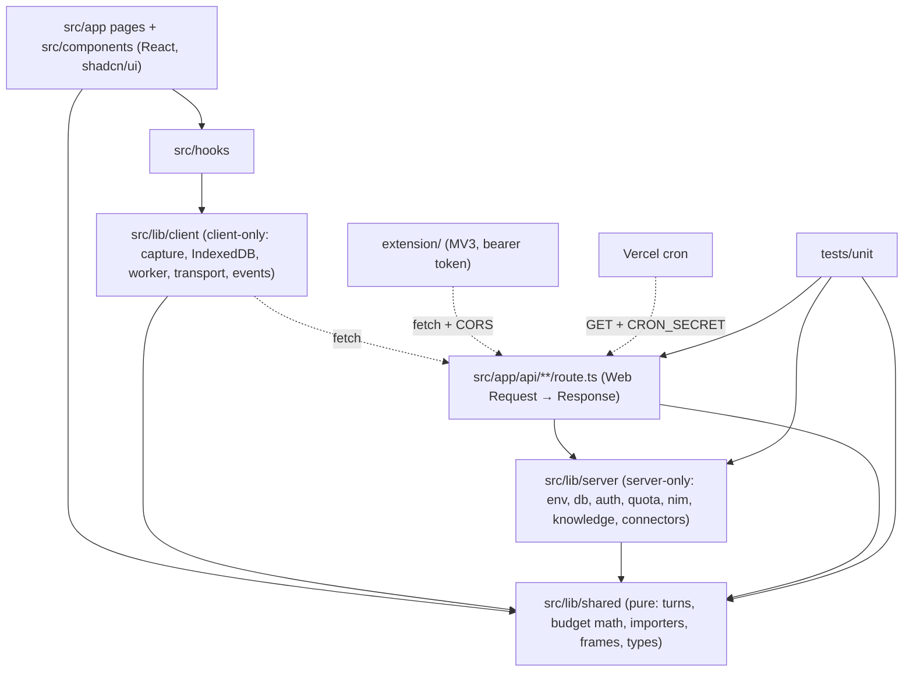
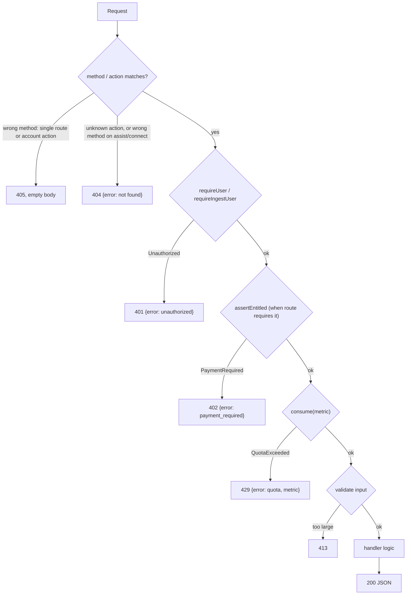
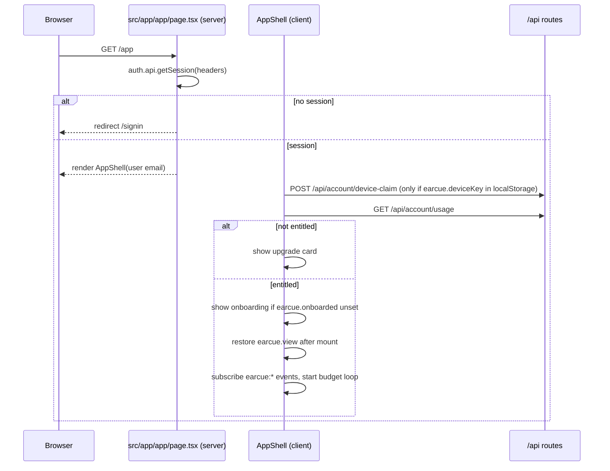
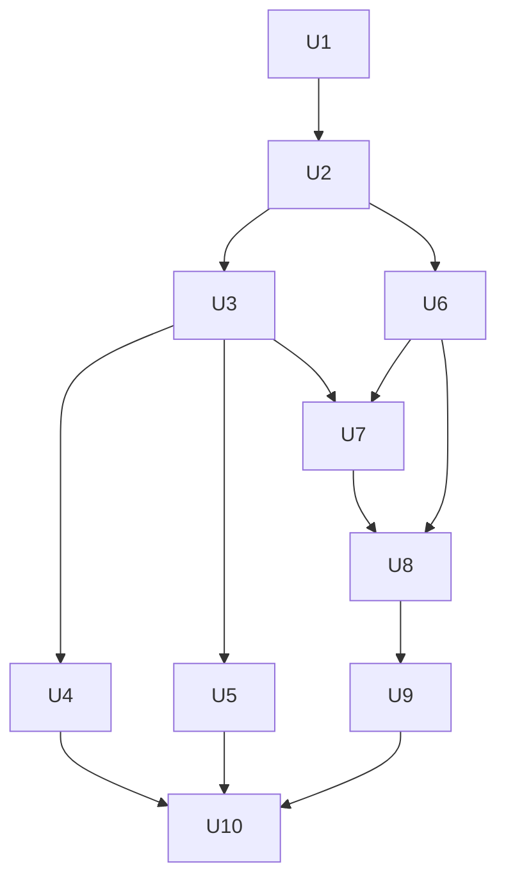

# Next.js, shadcn/ui and TypeScript Migration - Plan

## Goal Capsule

**Objective:** Move earcue from static HTML pages, hand-written browser ESM and root `api/` Vercel functions to a Next.js App Router app in strict TypeScript with shadcn/ui, with no user-visible or API-contract change, organized so unit and e2e tests can be added later without restructuring.

**Authority hierarchy:** Product Contract requirements (R-IDs) and Acceptance Examples override Key Technical Decisions; KTDs override unit Approach text; existing legacy behavior (the current `api/`, `app.js`, `src/`, `*.html`) is the reference whenever this plan is silent on a behavior.

**Stop conditions:** Stop and surface a blocker if preserving an API path, status code, or response body turns out to be impossible under Next.js route handlers; if the Vercel preview deployment rejects the build for function-count reasons; or if a change to the database schema, the browser extension, or AI/billing/auth business logic appears necessary.

**Execution profile:** One branch, one cutover. Units land as sequential commits; API routes are testable against `next dev` from U5, the full app is usable from U9, and the branch is deployable only after U10 deletes the legacy files.

**Tail ownership:** The implementer owns the Verification Contract parity checklist on a Vercel preview deployment before merge.

---

## Product Contract

### Summary

Rebuild the frontend as Next.js pages composed from shadcn/ui components, port every Vercel function to an App Router route handler at the same URL, and convert all JavaScript to strict TypeScript. Split code into shared (pure), server-only, client-only and UI layers so tests can target each layer directly. Port the existing `?selfcheck` assertions to Vitest as the migration's regression guard.

### Problem Frame

The app has no build step, no types and no test runner. UI is 741 lines of imperative DOM wiring in `app.js` plus four page-local inline scripts. Pure logic sits in the same modules as browser side effects, and server handlers are written against Node `req`/`res`. None of this can be unit-tested without a browser or a Vercel runtime. The user wants Next.js, shadcn/ui and TypeScript, and a structure ready for tests they will write later.

### Requirements

**Framework and language**

- R1. The app runs on Next.js App Router with TypeScript `strict`; no hand-served HTML page or root `api/` function remains.
- R2. UI is built from shadcn/ui components on Tailwind CSS v4, themed with the existing earcue tokens and fonts.

**Behavior parity**

- R3. Page URLs `/`, `/signin`, `/app`, `/account`, `/privacy`, `/terms` are preserved, and legacy `*.html` URLs redirect to their clean paths.
- R4. Every API path, method, status code, header contract and JSON body is preserved, including `/api/auth/*`, all dispatcher actions, extension CORS, cron and health.
- R5. The auth gate order and error shapes are preserved:
  - 401 → 402 → 429 → validation, with `{ "error": "..." }` bodies.
  - A wrong method on a single-endpoint route or a known account action returns 405 with an empty body.
  - An unknown dispatcher action, or a wrong method on an assist or connect action, returns 404 `{ "error": "not found" }`.
  - One accepted deviation: Next.js answers methods a route does not export with 405 before any auth check runs. Today, an unauthenticated PUT to `/api/traces` gets 401.
- R6. Capture, pipeline, meeting detection, budget pacing, IndexedDB storage and the frame worker behave as today, and capture keeps running across view switches.
- R7. The env contract is unchanged: variable names and defaults in `.env.example`, the billing/Google/connector feature flags, the daily cron schedule and the 60-second function durations.
- R8. The browser extension in `extension/` works unmodified against the migrated API.

**Test-ready structure**

- R9. Code is split into `shared` (pure, isomorphic), `server` (server-only), `client` (browser-only) and UI layers, and import direction is enforced at build time.
- R10. Route handlers use only Web `Request`/`Response` (no `next/headers` inside API logic), so a test can import a route module and call its exported method directly.
- R11. Vitest is configured with the project path alias, and every `selfCheck()` assertion group from `app.js` is ported to it and passes.

**Documentation**

- R12. `AGENTS.md` and `README.md` describe the new layout, commands and conventions in the same change that introduces them.

### Acceptance Examples

- AE1. Given no session cookie, device key or bearer token, when a client POSTs `/api/watch`, then the response is 401 `{"error":"unauthorized"}`.
- AE2. When a client sends GET `/api/watch`, then the response is 405 with an empty body.
- AE3. When the extension sends OPTIONS `/api/assist/begin`, then the response is 204 with `access-control-allow-origin: *`. When it then POSTs with `Authorization: Bearer ec_it_…`, the request is accepted, and a 401 on that route still carries the CORS headers.
- AE4. When a client sends GET `/api/assist/nonexistent`, then the response is 404 `{"error":"not found"}`.
- AE5. When a client POSTs an audio body larger than 8 MB to `/api/ingest/audio`, then the response is 413 `{"error":"audio chunk too large"}`.
- AE6. While capture is running, when the user switches All day → Day → Assist → All day, then capture never stops and the minute/synced counters keep advancing.
- AE7. When a browser requests `/app.html`, then it is redirected to `/app`.
- AE8. Given no session, when a browser requests `/app` or `/account`, then it lands on `/signin`.
- AE9. When the Google OAuth connect callback succeeds, then the response is a 302 to `/app?connected=google` that clears the `ec_oauth` cookie.

### Scope Boundaries

- The browser extension (`extension/`) is not modified beyond one comment that points at a moved file.
- Database schema, `db/migrations/`, and `scripts/migrate.mjs` are unchanged.
- AI prompts, schemas, quota metrics, billing rules, and auth configuration are ported as-is, not redesigned.
- No new product behavior, and no copy or layout redesign beyond what swapping to shadcn components implies.
- The `?selfcheck` URL mode is removed and replaced by the Vitest port (R11).

### Deferred to Follow-Up Work

- Writing the test scenarios listed under each unit, other than the U2 selfcheck port. That is the user's planned test pass.
- Installing Playwright and adding e2e tests under `tests/e2e/`.
- ESLint setup (`next lint` no longer exists in Next.js 16).
- Dark mode. The product has no dark theme today.
- Replacing the window CustomEvent bus with React state management.

### Assumptions

- The visual identity (warm paper background, orange accent, Geist / Geist Mono / Instrument Serif) carries into the shadcn theme instead of the shadcn default palette. The user confirmed the stack but did not choose a look, and these tokens are the product brand.
- The Vercel project stays on the Hobby plan and keeps the daily cron.

---

## Planning Contract

### Key Technical Decisions

- KTD1. **One cutover, not side-by-side.** Vercel's zero-config root `api/` functions and Next.js route handlers are separate routing systems, so running both would mean two function configs and duplicated auth wiring. Legacy files stay in the tree during the branch as the porting reference and are deleted together in U10.
- KTD2. **`src/`-rooted layout.** Use `src/app`, `src/components`, `src/hooks` and `src/lib/{shared,server,client}`, with the `@/*` alias mapped to `src/*`. Tests live in top-level `tests/unit/` mirroring `src/lib`, and `tests/e2e/` is reserved for Playwright.
- KTD3. **Layer enforcement uses `server-only` and `client-only`.** Every module in `src/lib/server` imports `server-only`, and every module in `src/lib/client` imports `client-only`. `src/lib/shared` imports neither and never imports from `server`/`client`. Vitest aliases both packages to empty modules so tests can load either layer.
- KTD4. **Dispatchers stay as dynamic segments.** `src/app/api/{account,connect,assist}/[action]/route.ts` keep today's URLs. Action logic moves to `src/lib/server/{account,connect}.ts` and `src/lib/server/assist/*.ts`, grouped by the `// ---------- … ----------` banners in `api/assist/[action].js`. This also keeps the function count bounded if the Hobby cap applies to Next.js builds (see Risks).
- KTD5. **Typed errors plus one response mapper.** `Unauthorized`, `PaymentRequired`, `QuotaExceeded` and a new `PayloadTooLarge` stay as classes. A single wrapper in `src/lib/server/respond.ts` maps them to 401/402/429(+`metric`)/413 and rethrows anything else. It replaces the try/catch repeated in every handler and `requireAuthed`'s response-or-null pattern.
- KTD6. **better-auth via `toNextJsHandler`.** `src/app/api/auth/[...all]/route.ts` exports `toNextJsHandler(auth)`. `requireUser` calls `auth.api.getSession({ headers })` with Web `Headers` instead of `fromNodeHeaders`. No `nextCookies` plugin is needed because no server action calls auth. The browser uses `createAuthClient` from `better-auth/react`. The Polar plugin config and webhook path under the catch-all are unchanged.
- KTD7. **Session gating happens in server components.** The `/app` and `/account` pages call `getSession` with `await headers()` and `redirect('/signin')`, so no `proxy.ts` is added. Mid-session expiry is still handled client-side through `earcue:signedout`.
- KTD8. **Keep the CustomEvent bus and module-scoped client state.** Capture must outlive view components (R6), and the `earcue:*` events already decouple modules. React components subscribe through one `useEarcueEvent` hook. Event names become a typed union with the same string literals.
- KTD9. **Strict TypeScript with types at the boundaries.** API request/response payload types live in `src/lib/shared/types.ts` and are used by both the client transport and handlers. DB row types sit next to their queries. LLM JSON is parsed as `unknown` and narrowed.
- KTD10. **Route segment config replaces most of `vercel.json`.** `export const maxDuration = 60` goes on the same eight routes as today. `vercel.json` keeps only `crons`. `cleanUrls` and the auth rewrite are removed, and `*.html` → clean path redirects move to `next.config.ts`.
- KTD11. **Theme by token mapping.** `src/app/globals.css` maps `--ec-*` onto the shadcn variables (light `:root` only), and brand extras (`--ec-accent`, display font, content widths) become Tailwind theme values. Fonts load through `next/font/google`, which drops the Google Fonts CDN link.

  | shadcn variable | earcue token |
  |---|---|
  | `--background` | `--ec-paper` |
  | `--foreground` | `--ec-ink` |
  | `--card`, `--popover` | `--ec-surface` |
  | `--muted` | `--ec-surface-sunken` |
  | `--muted-foreground` | `--ec-ink-secondary` |
  | `--border` | `--ec-line` |
  | `--input` | `--ec-line-strong` |
  | `--primary` / `--primary-foreground` | `--ec-contrast` / `--ec-on-contrast` |
  | `--accent` | `--ec-surface-hover` |
  | `--ring` | `--ec-focus` |
  | `--destructive` | `--ec-danger` |
  | `--radius` | `--ec-radius` (12px) |

- KTD12. **The audio ingest body is streamed with a byte counter.** App Router route handlers have no `bodyParser` config and no built-in size limit. The handler reads `request.body` incrementally and returns 413 once the total passes 8 MB, before buffering the rest. Vercel's own request-size limit still applies upstream, as it does today.
- KTD13. **Handler redirects use absolute URLs.** `Response.redirect` requires them, so OAuth start/callback redirects are built with `new URL(path, request.url)`, and `Set-Cookie` headers are set on the same response.
- KTD14. **Scripts.** `scripts/migrate.mjs` and `scripts/load-env.mjs` stay plain Node. `scripts/seed-admin.mjs` becomes `scripts/seed-admin.ts`, run through `tsx` with the `react-server` export condition so `server-only` resolves to its empty module.
- KTD15. **The frame worker uses the bundler URL pattern.** `new Worker(new URL('./frame-worker.ts', import.meta.url), { type: 'module' })` replaces the legacy import. The worker imports its pure signature functions from `src/lib/shared/frames.ts`.
- KTD16. **`runReview` moves out of the route file.** Next.js route modules may only export HTTP methods and segment config, so `runReview` (today exported from `api/review.js` and imported by the cron) moves to `src/lib/server/review.ts`.

### Alternatives Considered

- **Incremental migration, with legacy pages served from `public/` and API routes ported first.** Rejected: it adds a temporary routing layer and a second set of redirects that U10 would have to remove. Contract parity is proven with the Verification Contract checklist instead.
- **Keep `api/` as Vercel functions next to Next.js pages.** Rejected under KTD1: it leaves Node `req`/`res` handlers that can't be tested with plain `Request` objects (R10), and it keeps two routing configs.
- **A `proxy.ts` session gate.** Rejected: server-component gating covers both protected pages with no extra file, and API routes already authenticate per request.

### High-Level Technical Design

**Target layering.** Arrows point from importer to imported. Dotted edges are HTTP.



**Request gate order for every authenticated route.** The response mapper from KTD5 produces each error exit.



**`/app` boot sequence.** This ports `app.js` top-level await into a server gate plus one client effect.



**Unit dependencies.**



### Output Structure

```text
src/
  app/
    layout.tsx  globals.css  page.tsx
    signin/page.tsx  account/page.tsx  app/page.tsx
    privacy/page.tsx  terms/page.tsx
    api/
      auth/[...all]/route.ts
      health/route.ts  watch/route.ts  factcheck/route.ts
      traces/route.ts  review/route.ts
      ingest/audio/route.ts  ingest/frames/route.ts
      cron/review-sweep/route.ts
      account/[action]/route.ts
      connect/[action]/route.ts
      assist/[action]/route.ts
  components/
    ui/                      shadcn-generated
    app/  auth/  account/  marketing/
  hooks/use-earcue-event.ts
  lib/
    utils.ts
    shared/                  pure, isomorphic
      importers/
    server/                  server-only
      assist/
    client/                  client-only
tests/
  unit/shared/  unit/server/  unit/client/
  e2e/                       reserved (Playwright, deferred)
scripts/  db/  extension/    unchanged except scripts/seed-admin.ts
```

### System-Wide Impact

- **Browser extension:** it depends on `/api/assist/{begin,browser,items,finish}`, bearer ingest tokens and CORS preflight, so paths and headers must match exactly (AE3).
- **Vercel project:** the framework preset changes from Other to Next.js, the build command becomes `next build`, cron config stays in `vercel.json`, and durations move into route files.
- **Third-party callbacks:** the Google/Slack OAuth redirect URIs (`/api/connect/callback`, `/api/auth/callback/google`), the Polar webhook under `/api/auth/*` and the WAHA webhook `/api/connect/whatsapp-webhook` keep their URLs, so no console changes are needed.
- **Local development:** `npm run dev` becomes `next dev`. `npx vercel dev` is no longer required, and cron is tested locally by calling the route with `CRON_SECRET`.
- **Auth cookies:** the better-auth config is unchanged, so existing `better-auth.session_token` cookies stay valid across the deploy.

### Risks

| Risk | Mitigation |
|---|---|
| The Hobby 12-function cap may apply to Next.js route handlers differently; the docs consulted did not state it. | Keep the three dispatchers (KTD4), so the route count stays at 12 including auth. Read the function count in the first preview deployment summary before merge. |
| React StrictMode double-runs effects in dev, which could start capture twice or double-register listeners. | Capture start/stop stays idempotent in module scope (`src/lib/client/capture.ts`), and every effect returns a cleanup. |
| Hydration mismatch from `localStorage` view restore. | Read `earcue.view` and `earcue.onboarded` only after mount. |
| The Turbopack dev bundler may not handle the `new URL(..., import.meta.url)` worker pattern or `getDisplayMedia` flows the same as production. | U6 verifies worker load in both `next dev` and `next build && next start`. |
| Porting ~11.7k lines to strict TypeScript can silently change behavior. | The U2 selfcheck port runs first, handlers are ported line-for-line before any refactor, and the U10 parity checklist runs against the preview. |
| `server-only` throws when loaded by Vitest or Node scripts. | Vitest alias (KTD3) and the `react-server` condition for `tsx` scripts (KTD14). |

---

## Implementation Units

| U-ID | Title | Key files | Depends on |
|---|---|---|---|
| U1 | Scaffold Next.js, TypeScript, Tailwind, shadcn, Vitest | `package.json`, `next.config.ts`, `src/app/layout.tsx`, `src/app/globals.css` | — |
| U2 | Port shared pure logic with selfcheck tests | `src/lib/shared/*`, `tests/unit/shared/*` | U1 |
| U3 | Port server library | `src/lib/server/*` | U2 |
| U4 | Single-endpoint routes, auth, health, cron | `src/app/api/{auth,health,watch,factcheck,traces,review,ingest,cron}/**` | U3 |
| U5 | Dispatcher routes: account, connect, assist | `src/app/api/{account,connect,assist}/[action]/route.ts`, `src/lib/server/assist/*` | U3 |
| U6 | Port client runtime | `src/lib/client/*`, `src/hooks/use-earcue-event.ts` | U2 |
| U7 | Layout, public pages, sign-in, account | `src/app/{page,signin,account,privacy,terms}/**` | U3, U6 |
| U8 | App shell, ambient view, gates, toasts | `src/app/app/page.tsx`, `src/components/app/*` | U6, U7 |
| U9 | Day, Assist and Settings views | `src/components/app/{day,assist,settings}*` | U8 |
| U10 | Cutover: delete legacy, config, scripts, docs | `vercel.json`, `AGENTS.md`, `README.md`, `scripts/seed-admin.ts` | U4, U5, U9 |

### U1. Scaffold Next.js, TypeScript, Tailwind, shadcn and Vitest

**Goal:** A Next.js 16 app builds and renders a placeholder `/` in the earcue theme, with typecheck, build and test scripts in place.

**Requirements:** R1, R2, R9, R11

**Dependencies:** none

**Files:**
- Modify: `package.json`, `.gitignore`
- Create: `tsconfig.json`, `next.config.ts`, `postcss.config.mjs`, `components.json`, `vitest.config.ts`, `src/app/layout.tsx`, `src/app/page.tsx`, `src/app/globals.css`, `src/lib/utils.ts`, `src/components/ui/*`

**Approach:**
- Add `next`, `react`, `react-dom`, `server-only` and `client-only` as dependencies. Add `typescript`, `@types/node`, `@types/react`, `@types/react-dom`, `tailwindcss`, `@tailwindcss/postcss`, `vitest`, `vite-tsconfig-paths`, `jsdom` and `tsx` as dev dependencies. Keep `engines.node` at 22.x and `"type": "module"`.
- Scripts: `dev`, `build`, `start`, `typecheck` (no-emit tsc), `test` (Vitest run, passing with no tests until U2), plus the existing `migrate`, `migrate:baseline`, `seed:admin`, `env:pull`.
- `tsconfig.json` uses `strict` and the `@/*` → `src/*`. Legacy `.js` files are outside the TypeScript include set.
- Run shadcn init against the existing project. Add the components U7–U9 need: button, card, input, label, textarea, select, tabs, dialog, alert-dialog, sheet, dropdown-menu, badge, separator, alert, avatar, sonner.
- `globals.css` applies the KTD11 token mapping, and `layout.tsx` loads Geist, Geist Mono and Instrument Serif through `next/font/google`, exposed as CSS variables.
- `vitest.config.ts` uses the tsconfig paths plugin, Node environment by default, and aliases `server-only`/`client-only` to empty modules.
- `.gitignore` adds `.next/` and `next-env.d.ts`.

**Patterns to follow:** token values in `assets/earcue.css`.

**Execution note:** Mostly packaging and config; prove it with install, build and a rendered page rather than unit tests.

**Test expectation:** none — scaffolding only.

**Verification:** Build and typecheck pass; `/` renders on the paper background in Geist, and a shadcn Button shows the contrast colors.

### U2. Port shared pure logic to `src/lib/shared` with selfcheck regression tests

**Goal:** Every pure function the browser and server share exists in TypeScript under `src/lib/shared`, and every `selfCheck()` assertion from `app.js` passes against it in Vitest.

**Requirements:** R6, R9, R11

**Dependencies:** U1

**Files:**
- Create: `src/lib/shared/turns.ts`, `freshness.ts`, `history-paging.ts`, `budget.ts` (constants, `planIntervals`, `minVoicedMsFor`, `msUntilLocalMidnight`), `meetings.ts` (constants, `meetingTransition`), `vad.ts` (`isVoiced`, `updateFloor`, `RMS_FLOOR_MIN`), `frames.ts` (`shouldKeep`, `frameSignature`, `frameChanged`, `forceIntervalFor`, `sigDistance`, `pickDistinct`), `day.ts` (`localDayOf`), `alerts.ts` (`normalizeAlert` from `app.js`), `wav.ts`, `types.ts`, `importers/whatsapp.ts`, `importers/bookmarks.ts`, `importers/history.ts`
- Test: `tests/unit/shared/turns.test.ts`, `frames.test.ts`, `budget.test.ts`, `meetings.test.ts`, `vad.test.ts`, `alerts.test.ts`, `day.test.ts`, `importers.test.ts`, `freshness.test.ts`, `history-paging.test.ts`

**Approach:**
- Split each mixed legacy module: pure exports move here, and stateful or browser parts wait for U6 (`src/budget.js` loop, `src/meetings.js` apply/close, `src/vad.js` `createVoiceGate`, the `src/frame-worker.js` message loop).
- Port logic line-for-line and add types only. Never change constants: `FRAMES_PER_CALL` must still equal the pipeline's frame batch max.
- `parseBookmarksHtml` uses `DOMParser`, so its test file opts into the jsdom environment. All other shared tests run in Node.

**Execution note:** Port the `selfCheck()` assertions into the test files first, unchanged in inputs and expected values, then port each module until its file passes. These assertions are the characterization baseline for the whole migration.

**Patterns to follow:** `selfCheck()` in `app.js`; the shared-module pattern `src/freshness.js` already uses between `api/health.js` and the client.

**Test scenarios:** port each `selfCheck()` assertion group with its existing inputs and expected values:
- `shouldKeep`, `frameChanged`, `sigDistance`, `pickDistinct`, `forceIntervalFor`: keep/drop decisions, the change threshold and distinct-frame selection.
- `groupTurns`: turn grouping and the fallback-text path.
- `localDayOf`: the local day boundary.
- `meetingTransition`: open on sustained system speech (`OPEN_MS`), close after `QUIET_FLUSHES` quiet flushes, stay closed on isolated blips.
- `normalizeAlert`: shape normalization for each alert type.
- `planIntervals`, `minVoicedMsFor`, `msUntilLocalMidnight`, `FLOOR_MS`: intervals clamp between floor and ceiling as budget runs out.
- `isVoiced`, `updateFloor`: floor adapts and never drops below `RMS_FLOOR_MIN`.
- `parseWhatsappExport` (async), `parseBookmarksHtml`, `parseTakeoutHistory`: sample exports parse to the expected item counts and fields.
- `staleSources`: each stale source is reported past its limit, and none are reported when fresh.
- `nextHistoryEnd`, `historyCursor`: a short page ends paging, a full page moves the end back, and zero accepted rows returns `startTime`.

**Verification:** The Vitest suite passes with every ported assertion group represented, and no module in `src/lib/shared` imports from `server`, `client`, React, or browser globals at module load.

### U3. Port server library to `src/lib/server`

**Goal:** All of `api/_lib` plus `runReview` exist as typed, server-only modules that work with Web `Headers`/`Request`, with one typed-error response mapper.

**Requirements:** R4, R5, R7, R9, R10

**Dependencies:** U2

**Files:**
- Create: `src/lib/server/env.ts`, `db.ts`, `log.ts`, `secretbox.ts`, `plans.ts`, `entitlement.ts`, `quota.ts`, `nim.ts`, `embed.ts`, `knowledge.ts`, `connectors.ts`, `waha.ts`, `auth-server.ts`, `auth.ts`, `errors.ts`, `respond.ts`, `review.ts`
- Test: `tests/unit/server/respond.test.ts`, `tests/unit/server/env.test.ts`, `tests/unit/server/auth.test.ts`

**Approach:**
- Every module imports `server-only` (KTD3). Environment access stays limited to `env.ts`, with the existing exceptions carried over: `auth-server.ts`, and the health route's release SHA and `CRON_SECRET` read.
- `auth.ts`: `requireUser` and `requireIngestUser` take `Headers`. Session lookup uses `auth.api.getSession({ headers })`, and the device key comes from `headers.get('x-earcue-key')`. Hashing, first-sight user insert and ingest token `last_used_at` update are unchanged.
- `errors.ts` holds `Unauthorized`, `PaymentRequired`, `QuotaExceeded` (moved from their modules and re-exported where the legacy code imported them) and `PayloadTooLarge`.
- `respond.ts` provides the KTD5 wrapper and a JSON helper. Unknown errors are rethrown unchanged, so Next.js returns its 500 as the legacy runtime did.
- `review.ts` holds `runReview`, moved from `api/review.js` (KTD16).
- `db.ts` keeps the neon `sql` tagged template, and `auth-server.ts` keeps its own `pg.Pool`, both unchanged in behavior.

**Patterns to follow:** `api/_lib/*.js` as the source; the comments in `api/_lib/env.js` and `api/_lib/auth-server.js` explaining billing opt-in and Google omission carry over verbatim.

**Test scenarios:** written in the user's later test pass unless noted.
- The mapper turns `Unauthorized` into 401 `{"error":"unauthorized"}`.
- The mapper turns `PaymentRequired` into 402 `{"error":"payment_required"}`.
- The mapper turns `QuotaExceeded('watch_calls')` into 429 `{"error":"quota","metric":"watch_calls"}`.
- The mapper turns `PayloadTooLarge` into 413.
- The mapper rethrows a plain `Error`.
- `env`: accessing a missing required variable throws `missing required env: <NAME>`, and an unset defaulted variable returns its default.
- `billingEnabled()` is false when `BILLING_ENABLED=1` but `POLAR_WEBHOOK_SECRET` is empty.
- `connectorsEnabled().google` is false without `CONNECTOR_ENC_KEY`.
- `requireIngestUser` rejects a bearer that isn't `ec_it_…` without querying the DB.
- Integration (Neon test branch): `requireUser` with a valid session creates a `users` row with tz `UTC` on first call and reuses it on the second.
- Integration: a device-key header that matches `device_key_hash` resolves that user.

**Verification:** Typecheck passes, no `src/lib/server` module is imported from a client component (the build fails if one is), and `process.env` appears only in the allowed files.

### U4. Route handlers for single endpoints, auth, health and cron

**Goal:** Every non-dispatcher endpoint answers at its legacy URL with the same contract.

**Requirements:** R4, R5, R7, R10

**Dependencies:** U3

**Files:**
- Create: `src/app/api/auth/[...all]/route.ts`, `src/app/api/health/route.ts`, `src/app/api/watch/route.ts`, `src/app/api/factcheck/route.ts`, `src/app/api/traces/route.ts`, `src/app/api/review/route.ts`, `src/app/api/ingest/audio/route.ts`, `src/app/api/ingest/frames/route.ts`, `src/app/api/cron/review-sweep/route.ts`
- Test: `tests/unit/server/routes/watch.test.ts`, `ingest-audio.test.ts`, `health.test.ts`, `review-sweep.test.ts`

**Approach:**
- Each route exports only the methods the legacy handler accepted, so Next.js supplies the 405 (R5). Logic stays in `route.ts`, and only reusable pieces move to `src/lib/server`.
- `traces` and `review` export GET and POST, matching the legacy branches.
- The cron route exports GET (what Vercel cron sends) and POST, because the legacy handler accepted any method.
- `export const maxDuration = 60` on ingest/audio, ingest/frames, watch, factcheck, review and cron/review-sweep.
- Query parameters come from `new URL(request.url).searchParams`, and JSON bodies from `request.json()`. The legacy `req.body || {}` fallback becomes a caught parse failure that yields `{}`.
- Audio ingest follows KTD12.
- Health keeps the lazy `db` import on its authorized branch, so it still answers when `DATABASE_URL` is missing.

**Patterns to follow:** `api/watch.js` for the gate order; `api/health.js` for the lazy import.

**Test scenarios:** written in the user's later test pass unless noted.
- Covers AE1. POST `/api/watch` with no credentials returns 401.
- Covers AE2. GET `/api/watch` returns 405 with an empty body.
- `watch`, entitled user with quota: `chatJson` (mocked) is called with `MODEL_REASON`, `maxTokens` 600, `deadlineMs` 25000, and its result comes back as 200.
- `watch`, quota exhausted: 429 comes back and `chatJson` is never called.
- Covers AE5. A 9 MB audio stream returns 413 `{"error":"audio chunk too large"}`.
- Audio with `source=bogus` reports `source` `mic`, and `mime=audio/webm;codecs=opus` falls back to `audio/webm`.
- Audio where transcription throws `EmptyCompletion` returns 200 with `turns: []` and echoes `source`, `startedAt` and `durationMs`.
- Health with no Authorization header runs no DB query and omits `missing`/`stale`.
- Health with the correct `CRON_SECRET` bearer includes both, and returns 503 when `stale` is non-empty.
- The cron route with a wrong bearer returns 401 with an empty body.
- The cron route stops review work after 70% of `SWEEP_BUDGET_MS` and reports `truncated: true`.
- Integration: POST `/api/auth/sign-up/email` with billing disabled returns 200 and sets the session cookie.

**Verification:** Every endpoint above returns the legacy status and body for its happy path and each gate exit when called against `next dev`.

### U5. Route handlers for account, connect and assist dispatchers

**Goal:** All `[action]` endpoints answer at their legacy URLs with the same methods, CORS, cookies, redirects and bodies.

**Requirements:** R4, R5, R8, R10

**Dependencies:** U3

**Files:**
- Create: `src/app/api/account/[action]/route.ts`, `src/app/api/connect/[action]/route.ts`, `src/app/api/assist/[action]/route.ts`, `src/lib/server/account.ts`, `src/lib/server/connect.ts`, `src/lib/server/assist/meetings.ts`, `src/lib/server/assist/suggest.ts`, `src/lib/server/assist/imports.ts`, `src/lib/server/assist/memory.ts`, `src/lib/server/assist/tokens.ts`
- Test: `tests/unit/server/routes/assist.test.ts`, `connect.test.ts`, `account.test.ts`

**Approach:**
- Each route exports GET and POST, plus OPTIONS for assist, and dispatches from a table ported from the legacy if-chain:
  - Assist and connect key the table by `method + action`, and any miss returns 404 `{"error":"not found"}`.
  - Account keys the table by action only. Each action keeps its own method check, which returns 405 with an empty body, and an unknown action returns 404.
- Assist applies CORS headers for `begin`, `browser` and `finish` before dispatch. Those headers go on every response for those actions, including OPTIONS 204 and error responses (AE3). OPTIONS on any other action falls through to 404, as today.
- Connect returns 501 `{"error":"connectors_disabled"}` before dispatch when no connector env is set.
- OAuth start sets the `ec_oauth` cookie (Path `/api/connect`, HttpOnly, SameSite=Lax, Max-Age 600, Secure when the legacy `secureFlag()` says so) and redirects per KTD13.
- `requireAuthed({ entitled, allowToken })` becomes a throwing helper wrapped by the KTD5 mapper, with the same bearer-vs-session selection.
- Account export keeps its `content-disposition` attachment filename, and delete keeps clearing `better-auth.session_token`.
- `maxDuration = 60` on connect and assist.

**Patterns to follow:** the handler map in `api/assist/[action].js`; `handleWhatsappWebhook` in `api/connect/[action].js` for the timing-safe token check and 200-on-quota rule.

**Test scenarios:** written in the user's later test pass unless noted.
- Covers AE3. OPTIONS `/api/assist/begin` returns 204 with the four `access-control-*` headers.
- POST `begin` with an invalid bearer returns 401, still with `access-control-allow-origin: *`.
- Covers AE4. GET `/api/assist/nonexistent` returns 404. GET `/api/assist/suggest` (right action, wrong method) also returns 404.
- The `items` action with 300 rows inserts, and `finish` marks the import complete.
- `recall` with `rerank=1` for a non-pro user does not rerank.
- `recall` clamps `limit` between 1 and 25.
- Covers AE9. The OAuth callback with valid `code`/`state` returns 302 to an absolute `/app?connected=google` and clears `ec_oauth`.
- A callback failure returns 302 to `/app?connect_error=<provider>`.
- The WhatsApp webhook with a presented token of different length or content returns 401.
- The WhatsApp webhook with quota exhausted returns 200 `{"ingested":0,"quota":true}`.
- A `session.status` event with `FAILED` sets `last_error`.
- With all connector env unset, any connect action returns 501.
- POST `/api/account/export` returns 405 with an empty body, and GET `/api/account/nonexistent` returns 404.
- Account export sets an attachment `content-disposition` of `earcue-export-<userId>.json`.
- Account delete with a mismatched `confirmEmail` is rejected and deletes nothing.
- Integration: the extension's `background.js` sync against the preview completes a begin → browser → finish cycle.

**Verification:** Every action in the three legacy if-chains has a table entry, and the extension options page imports successfully against `next dev`.

### U6. Port client runtime to `src/lib/client`

**Goal:** Capture, storage, worker, pipeline, budget loop, meeting state, transport and connector/knowledge/day data calls run as typed client-only modules with no DOM lookups.

**Requirements:** R6, R8, R9

**Dependencies:** U2

**Files:**
- Create: `src/lib/client/api.ts`, `events.ts`, `auth-client.ts`, `localstore.ts`, `capture.ts`, `frame-worker.ts`, `pipeline.ts`, `vad-gate.ts`, `budget.ts`, `meetings.ts`, `assist.ts`, `connect.ts`, `knowledge.ts`, `day.ts`, `src/hooks/use-earcue-event.ts`
- Test: `tests/unit/client/api.test.ts`

**Approach:**
- `api.ts` ports `src/api.js` unchanged in behavior.
- `events.ts` declares the typed `earcue:*` name union and payload types, with dispatch and listen helpers (KTD8).
- `auth-client.ts` creates the better-auth React client (KTD6).
- Remove every `els` parameter and `document.getElementById` from `assist`, `connect`, `knowledge`, `day` and `budget`. Those modules keep their fetch and state logic and hand data to components through return values or events. Rendering moves to U8/U9.
- `capture.ts` keeps module-scoped streams and recorder, and `startAmbient`/`stopAmbient`/`setPaused` must be idempotent.
- `frame-worker.ts` keeps the `typeof window === 'undefined'` guard and imports signature functions from `src/lib/shared/frames.ts` (KTD15).
- `use-earcue-event` subscribes on mount and unsubscribes on cleanup.

**Patterns to follow:** `src/api.js`, `src/capture.js`, `src/localstore.js`, `src/frame-worker.js`.

**Test scenarios:** written in the user's later test pass unless noted.
- A 401 from `get`/`post` dispatches `earcue:signedout` and throws.
- A 402 dispatches `earcue:paymentrequired`.
- A 429 dispatches `earcue:quotaexceeded` with the parsed body. A body that fails to parse sends `{}` as detail.
- `postBinary` sends the blob with the given headers and `credentials: same-origin`.
- With the jsdom environment and `fake-indexeddb` added then, `sweep()` removes chunks older than the retention days and keeps newer ones.
- Calling `startAmbient` twice creates one recorder (mocked media APIs).
- `use-earcue-event` stops receiving events after unmount.

**Verification:** No file in `src/lib/client` references `document.getElementById`, and the frame worker loads and posts results in both `next dev` and a production build.

### U7. Root layout, public pages, sign-in and account

**Goal:** The landing, privacy, terms, sign-in and account pages render with shadcn components and behave as their legacy HTML did.

**Requirements:** R2, R3, R4, R6, R7

**Dependencies:** U3, U6

**Files:**
- Create: `src/app/page.tsx` (replaces the U1 placeholder), `src/app/privacy/page.tsx`, `src/app/terms/page.tsx`, `src/app/signin/page.tsx`, `src/app/account/page.tsx`, `src/components/marketing/*`, `src/components/auth/signin-form.tsx`, `src/components/account/account-panel.tsx`, `src/lib/shared/auth-errors.ts`
- Modify: `next.config.ts` (`*.html` redirects), `src/app/layout.tsx` (metadata, skip link)
- Test: `tests/unit/shared/auth-errors.test.ts`

**Approach:**
- Landing, privacy and terms are server components. Copy is ported verbatim, the `/#pricing` anchor is preserved, and layout from `landing.css` is expressed as Tailwind utilities. The wordmark with its accent dot is one small shared component.
- The sign-in page is a server component that passes `googleAuthEnabled()` to a client form. The form replaces the client-side `/api/health` probe with that prop.
- The sign-in form keeps the email/password mode toggle (autocomplete switching), `rememberMe: true` on sign-in, `name` set to the email local part on sign-up, and Google social sign-in with `callbackURL` `/app`, `newUserCallbackURL` `/app?welcome=1` and `errorCallbackURL` `/signin?error=1`. It shows the error on `?error` and navigates to `/app` on success.
- `auth-errors.ts` holds the pure error-code → message map.
- The account page gates on session (KTD7) and reads `billingEnabled()` server-side. The client panel keeps customer state/portal, checkout, export and delete. A shadcn AlertDialog replaces `window.confirm`/`alert`, and the exact-email confirmation rule stays.

**Patterns to follow:** `signin.html` and `account.html` inline scripts for behavior; `index.html`, `privacy.html` and `terms.html` for copy.

**Test scenarios:** written in the user's later test pass unless noted.
- `errorMessage` returns the exact legacy string for `INVALID_EMAIL_OR_PASSWORD`, `USER_ALREADY_EXISTS`, `USER_ALREADY_EXISTS_USE_ANOTHER_EMAIL`, `PASSWORD_TOO_SHORT` and `EMAIL_PASSWORD_SIGN_UP_DISABLED`, and the generic message for an unknown or missing code.
- Covers AE7. `/signin.html` and `/app.html` redirect to `/signin` and `/app`.
- Covers AE8. `/account` without a session redirects to `/signin`.
- The Google button is hidden when Google env is unset.
- Account with billing disabled shows `<plan> (billing disabled)` and no billing block.
- A delete attempt with the wrong email does nothing, and the right email plus confirm navigates to `/`.
- e2e (deferred to Playwright): sign up with email lands on `/app`.

**Verification:** Every page matches its legacy content and flows by manual walkthrough on `next dev`, and pages render without client-side console errors.

### U8. App shell, ambient view, gates and toasts

**Goal:** `/app` renders the sidebar shell, All day view, upgrade and onboarding cards, capture pill and alert toasts, driven by the U6 client runtime.

**Requirements:** R2, R3, R6

**Dependencies:** U6, U7

**Files:**
- Create: `src/app/app/page.tsx`, `src/components/app/app-shell.tsx`, `sidebar.tsx`, `account-menu.tsx`, `capture-pill.tsx`, `ambient-view.tsx`, `upgrade-card.tsx`, `onboard-card.tsx`, `alert-toasts.tsx`, `budget-chip.tsx`

**Approach:**
- The page gates on session (KTD7) and renders a client `AppShell` with the user's email.
- `AppShell` runs the boot sequence from the HTD diagram once, guarded against StrictMode re-entry. That covers device-key claim, entitlement check, onboarding, view restore after mount and the budget loop.
- The view choice (`ambient` | `day` | `assist`) is component state persisted to `earcue.view`. Unmounting a view never stops capture, because capture lives in `src/lib/client/capture.ts`.
- Toasts use sonner and port `showToast`: a factcheck action calls `checkClaim`, copy-draft copies the draft, and copy-draft and dismiss post `/api/assist/feedback`.
- The account menu is a shadcn DropdownMenu with Account & billing, Privacy and Sign out. Sign out calls the auth client and replaces the location with `/signin`.
- Events: `earcue:signedout` sends the user to `/signin`, `earcue:paymentrequired` shows the upgrade card, and `earcue:quotaexceeded`/`earcue:budget` update the budget chip.
- The Import recording file input calls `importRecording`.

**Patterns to follow:** `app.html` structure and `assets/app.css` layout and responsive rules (expressed as Tailwind utilities); the view routing, toast, auth and onboarding sections of `app.js`.

**Test scenarios:** written in the user's later test pass unless noted.
- Covers AE6. While capture runs, switching views keeps the capture pill live and counters advancing.
- An `earcue:paymentrequired` event shows the upgrade card with its reason text.
- Start free trial redirects to the checkout URL.
- `earcue:quotaexceeded` with metric `watch_calls` updates the budget chip.
- Dismissing onboarding sets `earcue.onboarded=1`, and a reload does not show it again.
- Reloading with `earcue.view=day` opens Day with no hydration warning.
- An `earcue:flag` factcheck toast runs `checkClaim` and renders the verdict.
- Dismiss posts feedback and removes the toast.

**Verification:** A full All day session (start, pause, resume screen, import recording) works on `next dev` with the same network calls as the legacy app. StrictMode dev shows one recorder and one listener per event.

### U9. Day, Assist and Settings views

**Goal:** The Day (timeline, review, search), Assist (suggestions, meeting notes) and Settings (ambient, connections, knowledge, account) surfaces work as in the legacy app.

**Requirements:** R2, R6, R8

**Dependencies:** U8

**Files:**
- Create: `src/components/app/day-view.tsx`, `assist-view.tsx`, `settings-sheet.tsx`, `settings-ambient.tsx`, `settings-connections.tsx`, `settings-knowledge.tsx`

**Approach:**
- Day uses shadcn Tabs for Timeline/Review, keeps the native `<input type="date">`, and ports the Today, search results, Review day and Refresh behaviors from `src/day.js`.
- Assist ports the suggestion list, meeting notes, Suggest now and Refresh, and keeps the throttle chip text.
- Settings is a shadcn Sheet opened from the sidebar.
  - Ambient: retention days (1–14) and blocklist, persisted through `localstore`.
  - Connections: provider buttons shown per `/api/health` `features.connectors`, OAuth start navigation, WhatsApp link with QR polling while status is `SCAN_QR_CODE`, and document upload.
  - Knowledge: profile summary and facts, the import list, bookmark/Takeout/WhatsApp file imports through the shared importers, Gmail/WhatsApp backfill, Learn now, extension token mint (shown once), excluded domains, and memory search/recall/remember with a space filter.
  - Account: links to account, privacy and terms.

**Patterns to follow:** `src/day.js`, `src/assist.js`, `src/connect.js`, `src/knowledge.js` and the settings dialog markup in `app.html`.

**Test scenarios:** written in the user's later test pass unless noted.
- Picking a past date loads that day's timeline, and Today resets it.
- Review day posts `/api/review` for the selected day and renders the result after Refresh.
- Importing a bookmarks `.html` file sends `begin`, then `items` in chunks, then `finish`, and lists the import.
- An excluded domains save posts `excludes` with one domain per line.
- The WhatsApp panel shows a QR while `SCAN_QR_CODE` and stops polling when linked.
- Recall with a space selected passes `container`.
- A minted extension token is displayed once and not refetched.
- With connectors disabled, the Connections section stays hidden.

**Verification:** Each settings control and each Day/Assist action produces the same API calls and visible result as the legacy app on `next dev`.

### U10. Cutover: remove legacy code, deployment config, scripts and docs

**Goal:** Only the Next.js app remains, deployment config is minimal, and docs describe the new structure.

**Requirements:** R1, R3, R7, R8, R12

**Dependencies:** U4, U5, U9

**Files:**
- Delete: `index.html`, `app.html`, `signin.html`, `account.html`, `privacy.html`, `terms.html`, `app.js`, `assets/`, `api/`, legacy `src/*.js`, `src/importers/*.js`, `scripts/seed-admin.mjs`
- Create: `scripts/seed-admin.ts`
- Modify: `vercel.json`, `package.json`, `AGENTS.md`, `README.md`, `extension/background.js` (comment path only)

**Approach:**
- `vercel.json` keeps `$schema` and `crons` only (KTD10).
- `seed:admin` runs the TypeScript script per KTD14.
- `AGENTS.md` gets its layout, the layer rules (KTD3), the route handler shape and response mapper, env rules, the CustomEvent bus, test locations and commands, and dev commands rewritten. The "no bundler/tsconfig/eslint" rule is removed, and the Vercel dev recursion note is replaced.
- `README.md` gets its setup and project layout updated.
- Set the Vercel project framework preset to Next.js before the first preview.
- Run the Verification Contract parity checklist on the preview and record the deployment's function count.

**Test expectation:** none — deletion and config; proven by the parity checklist.

**Verification:** The repo has no `.html` pages, root `api/` or `.js` source outside `extension/` and `scripts/*.mjs`, and the preview passes the full parity checklist.

---

## Verification Contract

**Gates for every unit:** `npm run typecheck`, `npm run build` and `npm test` all pass. `npm test` runs the U2 selfcheck port from U2 onward.

**Static checks at U10:**
- No `document.getElementById` under `src/`.
- `process.env` appears only in `src/lib/server/env.ts`, `src/lib/server/auth-server.ts` and `src/app/api/health/route.ts`.
- No `src/lib/shared` file imports from `@/lib/server`, `@/lib/client`, `react` or `next`.

**Parity checklist.** Run on `next dev` with a real `.env.local`, then on the Vercel preview:
1. Email sign-up, sign-out and sign-in. The wrong-password message matches. Google sign-in works when configured.
2. AE1, AE2, AE4 and AE5 via curl.
3. AE3: the extension syncs history and bookmarks against the preview using a newly minted token.
4. `/api/health` returns `features` unauthenticated and `missing`/`stale` with the `CRON_SECRET` bearer.
5. The cron route runs with `CRON_SECRET`, and the preview shows the cron registered at `0 6 * * *`.
6. `/app`: start capture, see traces sync, switch views (AE6), pause/resume screen, import recording, trigger an assist suggestion, get a watch flag toast.
7. Day review generation, and a search result.
8. Settings: import each file type, set excluded domains, recall memory, mint a token, Google/Slack connect round trip (AE9) where configured.
9. Account: export downloads JSON. Delete on a throwaway account removes it and lands on `/`.
10. AE7 and AE8.
11. The preview deployment summary shows the function count, and no function exceeds its duration config.

---

## Definition of Done

**Global:**
- R1–R12 are satisfied.
- Every Verification Contract gate and parity checklist item passes on the Vercel preview.
- Legacy files listed in U10 are deleted.
- `AGENTS.md` and `README.md` match the new structure.
- No abandoned experimental code, commented-out legacy blocks, or unused dependencies remain in the diff.
- `@neondatabase/serverless`, `better-auth`, `@polar-sh/*` and `pg` stay at their current major versions.

**Per unit:** each unit's Verification outcome holds, and its Test scenarios are either implemented (U2) or left as the written backlog for the user's test pass.

---

## Sources

- Legacy reference: `api/watch.js` (gate order), `api/assist/[action].js` (dispatch table, CORS, `requireAuthed`), `api/connect/[action].js` (OAuth cookie/redirects, WAHA webhook), `api/ingest/audio.js` (raw body, 8 MB cap), `api/health.js` (lazy DB import), `api/cron/review-sweep.js` (budget split), `api/_lib/env.js`, `api/_lib/auth.js`, `api/_lib/auth-server.js`, `app.js` `selfCheck()`, `src/api.js`, `src/capture.js`, `signin.html`, `account.html`, `assets/earcue.css`, `vercel.json`, `AGENTS.md`.
- Next.js 16 route handler docs (`route.mdx`): `params` is a Promise, unsupported methods return 405, and App Router segment config has no `bodyParser` or size limit (KTD12).
- Next.js 16 upgrade guide: `middleware.ts` is renamed to `proxy.ts` and runs on Node.js only. Not used here (KTD7).
- Next.js Vitest guide: `vitest`, `@vitejs/plugin-react`, `vite-tsconfig-paths` setup (U1).
- better-auth Next.js integration: `toNextJsHandler`, `getSession({ headers: await headers() })`, `nextCookies` needed only for server actions (KTD6).
- shadcn/ui manual installation: Tailwind v4 `@theme inline` variable mapping and `components.json` aliases (KTD11).
- Vercel docs: `export const maxDuration` in App Router routes, cron route handlers with `CRON_SECRET`, `vercel.json` `crons` (KTD10).
