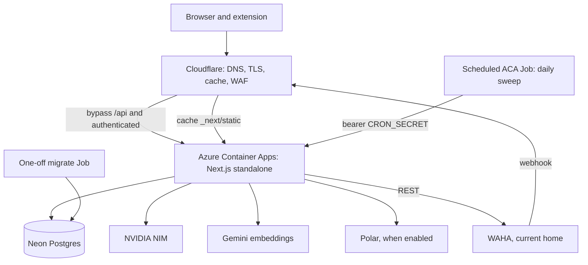
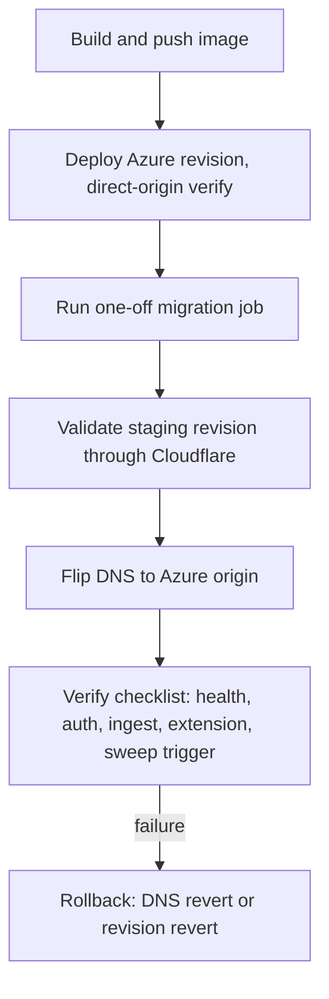

> **Superseded.** This plan's central technical decision (full Next.js server on Azure Container Apps,
> Cloudflare as DNS/proxy only) no longer matches the directive to run the Next.js frontend on Cloudflare
> Workers, with WAHA and all LLM inference on Azure. See
> `docs/plans/2026-09-17-azure-cloudflare-hosting-plan.md` for the current plan.

# Azure and Cloudflare Production Deployment - Plan

## Goal Capsule

- **Objective:** earcue runs in production on Azure behind Cloudflare, with sign-in, capture ingest, reviews, memory recall, imports, billing wiring, nightly sweep, and health checks all working as today.
- **Means:** Full Next.js standalone server on Azure Container Apps with Neon Postgres kept in place, Cloudflare as DNS plus cache plus protection only (KTD1, KTD2).
- **Authority:** User directive (Azure plus Cloudflare) outranks cost convenience. Repo conventions in `AGENTS.md` outrank generic deploy guides. Official Azure, Cloudflare, Next.js, and Neon docs outrank community posts.
- **Stop conditions:** Production serves the public URL through Cloudflare. Unauthenticated `/api/health` returns 200. The nightly sweep runs from Azure on schedule. Cutover completes with a tested rollback path.
- **Execution profile:** Mostly packaging plus configuration plus one small code touch (release SHA). Prefer smoke and runtime proof over unit coverage on every unit.
- **Who finishes:** One implementer with the Azure and Cloudflare CLIs already authenticated, plus access to the Neon connection string and the production secret values.

---

## Product Contract

### Summary

Package the existing Next.js 16 app as a standalone container. Run it on Azure Container Apps with secrets from Azure secret storage. Put Cloudflare in front for DNS, TLS, caching of static assets, and WAF plus rate limiting. Keep Neon Postgres where it is. Replace the Vercel cron with a scheduled Azure job. Run database migrations as a one-off job. Cut over with a parallel run plus DNS flip, and keep a rehearsed rollback.

### Problem Frame

The app runs on Vercel today with Neon Postgres, a single daily cron entry, and secrets managed by Vercel. The user wants the entire project on Azure plus Cloudflare. There is no Dockerfile, no infrastructure directory, and no captured deployment learning in this repo. Several Vercel-era assumptions stop holding the moment the app leaves Vercel: `maxDuration = 60` is silently ignored outside Vercel, the release SHA env var no longer exists, cron has no platform equivalent, and health-check semantics that were harmless on serverless can restart-loop a container host. The plan exists to name each of those traps before implementation spends effort in the wrong place.

### Key Decisions

- **KD1. Production runs on Azure with Cloudflare in front.** Azure hosts the app plus scheduled work. Cloudflare provides DNS, caching, and protection. (session-settled: user-directed — chosen over staying on Vercel: the user explicitly wants Azure plus Cloudflare, and research found the move feasible with no code-architecture change). Governs R1, R2, R3, R4, R5, R6, R7.

### Requirements

**Packaging**

- R1. The app ships as a self-contained container image built from this repo with no secrets baked into any layer.
- R2. The image runs the full Next.js server (pages, API routes, extension CORS behavior) unchanged in behavior, with no edge-runtime rebuild.

**Hosting and secrets**

- R3. Azure runs the container with `minReplicas` of at least 1 in production, external ingress, and all required env vars injected at runtime from secret storage.
- R4. `BETTER_AUTH_URL` equals the public Cloudflare HTTPS URL, and `WAHA_WEBHOOK_BASE_URL` is set whenever WAHA cannot reach the app through the public URL.

**Fronting**

- R5. Cloudflare terminates public TLS, proxies to the Azure origin, caches only immutable static assets, bypasses all API and authenticated traffic, preserves the extension CORS headers, and does not break ingest uploads, auth, webhooks, or the cron path.

**Data and scheduled work**

- R6. Neon Postgres stays the database. Migrations run exactly once per deployment from a single-replica job, never from container startup.
- R7. The daily sweep runs once per day on the existing schedule over the existing authenticated contract, and health probes use the unauthenticated health branch for readiness only.

**Cutover and operations**

- R8. Cutover is a parallel run with a DNS flip, verified against a checklist, with rollback defined and rehearsed.
- R9. Local development flow (`npm run dev:up`, `env:pull`, scripts) keeps working unchanged.
- R10. Repo docs that describe hosting, env, or operations reflect the new deployment in the same commit that lands it.

### Success Criteria

- Public URL through Cloudflare returns the app with a valid certificate.
- Unauthenticated `GET /api/health` returns 200 with zero missing env.
- A manual trigger of the scheduled sweep returns a success payload within budget.
- Extension sync (begin, chunked items, finish), sign-in, ingest, and review generation each complete once through the Cloudflare URL.
- Rollback (DNS revert or Azure revision revert) is exercised at least to the point of proving the path exists.

### Scope Boundaries

- In scope: Dockerfile, Azure hosting plus secrets plus jobs plus probes, Cloudflare DNS plus TLS plus cache plus WAF posture, migration and cron execution, cutover plus rollback, doc updates.
- Out of scope: rebuilding any route for the edge runtime. Moving Postgres off Neon. Changing app behavior, quotas, or billing logic.
- Deferred for later: a permanent preview environment (validate on a temporary staging revision instead). Moving WAHA onto Azure (see Open Questions). Premium ingress, static outbound IP or NAT, Azure-managed Postgres. Second daily cron for per-timezone reviews.

### Open Questions

- OQ1. Where does WAHA live after cutover? Default: WAHA stays where it runs today and only the app URL vars are rewired. A WAHA move to Azure (always-on app plus Azure Files volume) is follow-up work, not this cutover.
- OQ2. Which domain and Cloudflare zone front production, and which Azure subscription plus resource group hosts it? Needed before U2 begins; U2 creates resources from these inputs.

### Dependencies

- Azure subscription with billing, one resource group, one container registry, one Container Apps environment.
- Cloudflare zone ownership for the chosen domain with proxy control.
- Production secret values: `DATABASE_URL` (pooled), `DATABASE_URL_UNPOOLED` (direct, for migrations), `BETTER_AUTH_SECRET`, `CRON_SECRET`, `NVIDIA_API_KEY`, `GEMINI_API_KEY`, plus whichever connector and Polar values are live.

---

## Planning Contract

### Key Technical Decisions

- KTD1. Host the full Next.js server on Azure Container Apps, with Cloudflare proxy-only in front (session-settled: user-directed — chosen over staying on Vercel or splitting static plus server: the user directed Azure plus Cloudflare and research found the full-server container feasible with no behavior change). Instantiates KD1 for R1, R2, R3, R5. App Service adds nothing here and complicates jobs plus Docker plus cron. Split static plus server adds an ops seam for zero app benefit.
- KTD2. Cloudflare does DNS plus TLS plus cache plus WAF only. No Workers logic, no edge cron, no Cloudflare-side request shaping beyond cache bypass and threat protection. Rationale: every dynamic behavior already lives in the Next.js server and is covered by R5 bypass rules. Covers R5.
- KTD3. Keep Neon Postgres over the internet with the pooled host plus a per-container pool of 1 to 2. Chosen over Azure Flexible Server. Rationale: pgvector HNSW `vector(768)` is already migrated and working, the Neon HTTP driver suits elastic replicas, and a move re-proves vectors for no workload benefit. Covers R6.
- KTD4. Secrets live in Container Apps secret storage with Key Vault references behind a managed identity. Resource shape is checked in as code. Secret values never enter the repo, the image, or CI logs. Chosen over portal-only click-ops and over build-time env. Covers R3.
- KTD5. The daily sweep becomes a scheduled Container Apps Job calling the existing route contract with `curl` plus the bearer secret. Migrations become a one-off single-replica job. Readiness probes the unauthenticated health branch. Liveness is TCP only. Chosen over a cron sidecar, Logic Apps, startup migration, and health-as-liveness. Rationale: the migrator has per-file transactions but no global lock, so concurrent startup migration can double-apply. Health returns 503 on stale data, which is an ops signal, not a dead process. Restarting on it turns stale data into a restart storm. Covers R6, R7.
- KTD6. Cutover is a parallel run with DNS flip and two rollback paths (DNS revert, Azure revision revert). Chosen over a hard switch. Rationale: DNS revert is the fastest path back and revision revert covers a bad image with DNS left alone. Covers R8.

### High-Level Technical Design

Production traffic shape, directional guidance rather than implementation specification:



Cutover order, directional guidance rather than implementation specification:



### Assumptions

- Single-user steady state from prior repo research holds, so default ACA sizing plus `minReplicas: 1` is the starting point, not a tuned value.
- The `CloudflareFronting` research pass returned an unusable placeholder, so Cloudflare specifics here rest on the Azure report plus the official docs it links. The implementer re-verifies cache and WAF rule shape against current Cloudflare docs at execution.
- No institutional deployment learning exists in this repo, so secret, migration, and cutover conventions are defined here from scratch.
- `maxDuration = 60` settings stay in the code untouched. They are inert outside Vercel. Real ceilings are the in-app sweep budget, the Cloudflare proxy ceiling near 100 to 120 seconds, and the ACA ingress default near 240 seconds.
- WAHA defaults to staying put per OQ1. If it must move, that is a separate plan.

### Sequencing

U1 first (nothing deploys without an image). U2 plus U3 next in either order against a staging revision. U4 once the staging app talks to Neon. U5 last. U2 needs OQ2 answered before any Azure resource is created.

### Output Structure

New and touched shape for review, per-unit file lists stay authoritative:

```text
Dockerfile                    # new: multi-stage Node 22 standalone build
.dockerignore                 # new: excludes .env*, git, node_modules
next.config.ts                # modify: add output standalone, keep redirects
src/app/api/health/route.ts   # modify: release SHA fallback chain
infra/                        # new: checked-in Azure plus Cloudflare shape
  aca.yaml                    # app, env, secrets refs, probes, ingress
  jobs.yaml                   # scheduled sweep job plus one-off migrate job
  cloudflare.md               # DNS, TLS, cache, WAF posture as code-adjacent doc
  runbook.md                  # cutover plus rollback checklist
AGENTS.md, README.md          # modify: hosting, env, ops notes
.env.example                  # modify: document DATABASE_URL_UNPOOLED, COMMIT_SHA
```

---

## Implementation Units

### U1. Containerize the Next.js standalone server

- **Goal:** A runnable production image with no secrets in it and behavior identical to today.
- **Requirements:** R1, R2.
- **Dependencies:** None.
- **Files:** `Dockerfile` (new), `.dockerignore` (new), `next.config.ts` (modify), `src/app/api/health/route.ts` (modify: read `COMMIT_SHA` before the Vercel var before `dev`), `.env.example` (modify: document `COMMIT_SHA`).
- **Approach:**
  1. Set standalone output in `next.config.ts`, keeping the legacy redirects.
  2. Add a multi-stage Dockerfile on a pinned Node 22 Debian-slim base: deps, builder, runner. Copy lockfile first for layer caching. Run as non-root with `.next` writable. Copy `public/` plus `.next/static` into the runner.
  3. Add `.dockerignore` excluding `.env*`, `.git`, `node_modules`.
  4. Wire the release fallback chain and pass the image tag as `COMMIT_SHA` at build.
  5. Decide `sharp` at build time: install it in the runner only if any page uses `next/image` optimization, else skip.
- **Execution note:** This is packaging. Prefer build plus run smoke over unit coverage.
- **Patterns to follow:** `src/lib/server/env.ts` lazy-required env (nothing required at import or build). `package.json` engines Node 22 and `next build` plus `next start` scripts. Never `process.env` outside `env.ts` except the existing health release read.
- **Test scenarios:**
  1. Build from a clean tree with no `.env.local` present, then inspect the image filesystem and confirm no secret material or env file is inside.
  2. Run the container with the six required env vars pointed at a staging database, then `GET /api/health` returns 200 with zero missing and the expected release value.
  3. Run the container with one required var removed, then `GET /api/health` returns 503 naming the gap and the container stays up.
  4. Request a static asset and an authenticated API path and confirm both serve correctly from the container.
- **Verification:** Image builds cleanly, runs locally, and health gates behave as above.

### U2. Azure hosting, secrets, and networking

- **Goal:** The container runs on Container Apps behind its own URL with production secrets injected and direct-origin access verified.
- **Requirements:** R3, R4, R9.
- **Dependencies:** U1.
- **Files:** `infra/aca.yaml` (new), `.github/workflows/ci.yml` (modify: add image build and push), `AGENTS.md` (modify: hosting notes).
- **Approach:**
  1. Create the subscription, resource group, registry, and Container Apps environment from OQ2 inputs.
  2. Create the app with external ingress, `minReplicas: 1`, and TCP liveness plus health readiness (probe paths fixed in U4).
  3. Wire required secrets through secret storage with Key Vault references on a managed identity. Keep `DATABASE_URL` pooled and `DATABASE_URL_UNPOOLED` direct as separate secrets. Keep `BILLING_ENABLED=0` until all three Polar vars are real.
  4. Set `BETTER_AUTH_URL` to the future public Cloudflare URL from the start, and set `WAHA_WEBHOOK_BASE_URL` whenever WAHA cannot reach the public URL.
  5. Restrict direct-to-origin bypass with ingress IP restrictions to Cloudflare ranges or an app-level origin check.
- **Execution note:** This is infrastructure. Prefer live revision smoke over unit coverage.
- **Patterns to follow:** `src/lib/server/env.ts` required-versus-default split. `src/lib/server/auth-server.ts` lazy construction (missing env fails at first use, which is what readiness gating catches).
- **Test scenarios:**
  1. Deploy a staging revision, then request its direct Azure URL and confirm the app responds without Cloudflare in the path.
  2. Remove one required secret from the revision, then confirm the revision leaves rotation via readiness while the old revision keeps serving.
  3. Request the origin URL from a non-Cloudflare address, then confirm the bypass restriction answers as configured.
- **Verification:** Staging revision serves on its Azure URL with secrets injected and no values in logs.

### U3. Cloudflare DNS, TLS, cache, and protection

- **Goal:** The public URL terminates TLS at Cloudflare, caches only what is safe, and leaves every dynamic flow untouched.
- **Requirements:** R5.
- **Dependencies:** U2.
- **Files:** `infra/cloudflare.md` (new: zone, DNS, TLS mode, cache rules, WAF posture).
- **Approach:**
  1. Point DNS at the Azure origin and set SSL to Full strict. If Azure managed certificates are used, verify with proxy DNS-only first, then re-enable proxying.
  2. Cache `_next/static/*` aggressively. Bypass cache for `/api/*` and never cache authenticated, cron, or health responses.
  3. Exclude sign-in, ingest, extension sync, Polar webhook, WAHA webhook, and the sweep path from aggressive bot or rate-limit rules.
  4. Pass the app CORS headers through untouched with no duplicate CORS policy at Cloudflare.
- **Execution note:** This is edge configuration. Prefer header plus behavior smoke over unit coverage.
- **Patterns to follow:** The wildcard CORS headers on the assist begin, browser, and finish actions. Extension chunked protocol with chunk size 300 and multi-megabyte bodies.
- **Test scenarios:**
  1. Request the public URL and confirm a valid certificate and the Azure origin behind the proxy.
  2. Request a hashed static asset twice and confirm the second response shows a cache hit, then request an API route twice and confirm both bypass cache.
  3. Run one extension sync batch through the public URL and confirm begin, chunked items, and finish all succeed with CORS headers intact.
  4. Post one ingest audio payload near current batch sizes and confirm it is accepted within the proxy time ceiling.
- **Verification:** Static hits cache, dynamic bypasses, extension and ingest flows pass through the proxy.

### U4. Database migrations, scheduled sweep, and probes

- **Goal:** Neon stays, migrations run once and safely, the sweep fires on schedule, and probes never restart a healthy-but-stale app.
- **Requirements:** R6, R7.
- **Dependencies:** U2.
- **Files:** `infra/jobs.yaml` (new), `scripts/migrate.mjs` (no change expected), `src/app/api/cron/review-sweep/route.ts` (no change expected).
- **Approach:**
  1. Run the migrator as a one-off single-replica job with the direct connection string. Use `--baseline` exactly once against the existing Neon database, then plain runs per deployment.
  2. Create the scheduled job with the existing cron expression in UTC, same image, `curl` entrypoint against the route with the bearer secret, single parallelism, retry at most once, timeout at least 120 seconds.
  3. Set readiness to the unauthenticated health branch and liveness to TCP. Keep external uptime polling on the unauthenticated branch so monitoring never pays for database queries.
- **Execution note:** This is scheduling plus data safety. Prefer job-run smoke over unit coverage.
- **Patterns to follow:** `scripts/migrate.mjs` append-only `schema_migrations` tracking. Sweep idempotency through the completed-status guard. Health authorized branch isolation for stale and cost reports.
- **Test scenarios:**
  1. Run the migrate job against staging with no pending files and confirm it reports zero pending and changes nothing.
  2. Trigger the sweep job manually with the bearer secret and confirm a success payload within budget, then trigger without the secret and confirm 401.
  3. Push a staging source past its `HEALTH_STALE_*` threshold with no sync and confirm readiness reports 503 while the container keeps running with no restart.
- **Verification:** Migrations apply once, the sweep succeeds on demand and on schedule, and stale data never causes a restart.

### U5. Cutover, rollback, and doc updates

- **Goal:** Production moves to Azure plus Cloudflare on a checklist with a proven way back, and the repo describes the new reality.
- **Requirements:** R8, R9, R10.
- **Dependencies:** U1, U2, U3, U4.
- **Files:** `infra/runbook.md` (new), `AGENTS.md` (modify), `README.md` (modify), `.env.example` (modify).
- **Approach:**
  1. Validate the full checklist on the staging revision through Cloudflare: health, sign-in, ingest, extension sync, review generation, manual sweep trigger.
  2. Confirm Polar webhook and WAHA callback reachability when those integrations are live.
  3. Flip DNS to the Azure origin during a quiet window and re-run the checklist in production.
  4. Define rollback triggers up front: failed checklist, elevated 5xx, broken auth or ingest. Roll back by DNS revert, or by Azure revision revert for a bad image.
  5. Update `AGENTS.md` hosting and ops sections, the README deploy surface, and `.env.example` in the same landing commit.
- **Execution note:** This is operations. Prefer checklist smoke over unit coverage.
- **Patterns to follow:** `/api/health` as the readiness and monitoring gate. Existing `console.error` plus `log` plus `logError` failure signals.
- **Test scenarios:**
  1. Walk the staging checklist end to end through Cloudflare and confirm every item passes before any DNS change.
  2. Exercise the rollback path at least to a proven revert (DNS revert or revision revert) and confirm the previous serving state returns.
  3. Sign in, capture, sync the extension, and generate a review after cutover and confirm each works in production.
- **Verification:** Checklist green in production, rollback proven, docs landed.

---

## Verification Contract

| Check | Command or probe | Applies |
|---|---|---|
| Types | `npm run typecheck` | U1 health touch |
| Unit suite | `npm test` | U1 health touch |
| Production build | `npm run build` | U1 |
| Image smoke | Build plus run plus `GET /api/health` cases from U1 | U1 |
| Origin smoke | Direct Azure URL plus readiness behavior from U2 | U2 |
| Edge smoke | TLS, cache hit versus bypass, extension and ingest flows from U3 | U3 |
| Jobs smoke | Migrate plus manual sweep plus stale-probe behavior from U4 | U4 |
| Cutover checklist | `infra/runbook.md` walked in staging then production | U5 |

---

## Definition of Done

- Public production URL serves through Cloudflare with valid TLS.
- Health, auth, ingest, extension sync, review generation, and the scheduled sweep each verified through the production path.
- Migrations run once per deployment from the job, never from container startup.
- Rollback path proven and documented in `infra/runbook.md`.
- `AGENTS.md`, README, and `.env.example` updated in the landing commit.
- No secret material in the image, the repo, or CI logs. No abandoned scaffolding left in the diff.

---

## Risks and Dependencies

- Wrong `BETTER_AUTH_URL` breaks auth site-wide. Mitigation: set it to the public URL from the first staging deploy and validate sign-in before cutover.
- Baking secrets into the image leaks them. Mitigation: `.dockerignore` plus runtime injection only, verified by U1 scenario 1.
- Startup migration races without a lock. Mitigation: one-off job only, enforced by KTD5.
- Health-as-liveness turns stale data into restarts. Mitigation: TCP liveness, health readiness only.
- Cloudflare caching or WAF breaks API, auth, webhooks, or uploads. Mitigation: bypass plus exclusion rules and U3 scenarios 3 and 4.
- TLS issuance fails behind the proxy. Mitigation: DNS-only issuance ordering in U3.
- Neon pool exhaustion from elastic replicas. Mitigation: pooled host plus per-container pool of 1 to 2 per KTD3.
- Proxy time ceiling near 100 to 120 seconds. Mitigation: 60-second route budgets stand, and any future slower route bypasses the proxy or goes async.
- WAHA webhook points somewhere unreachable. Mitigation: explicit `WAHA_WEBHOOK_BASE_URL` per R4.
- Cost and setup burden exceed Vercel-era zero. Mitigation: acknowledged consequence of the directed move, not a surprise. Neon stays to bound it.

---

## Appendix

### Sources and research

- Prior repo research: `.wayfinder/research/005-hosting-comparison.md` (Azure Container Apps rates, WAHA always-on need, Neon fit), `.wayfinder/research/007-free-hosting-verdict.md` (route and dependency inventory, Neon and cron fit), `.wayfinder/research/004-cost-model.md` (sweep budget and call shapes).
- External guidance: Azure plus Cloudflare deployment report from this planning run, built on official Next.js deployment docs, Docker Next.js guide, Azure Container Apps ingress plus jobs plus probes plus secrets docs, Cloudflare cache plus TLS plus 524 docs, and Neon pooling docs, with community corroboration where noted in that report.
- Repo grounding: `package.json`, `vercel.json`, `next.config.ts`, `.env.example`, `src/lib/server/env.ts`, `src/lib/server/db.ts`, `src/lib/server/auth-server.ts`, `src/lib/server/auth.ts`, `src/lib/server/respond.ts`, `src/lib/server/waha.ts`, `src/app/api/**/route.ts` (12 handlers, 8 with `maxDuration = 60`), `src/app/api/health/route.ts`, `src/app/api/cron/review-sweep/route.ts`, `src/app/api/assist/[action]/route.ts` (CORS), `scripts/migrate.mjs`, `db/migrations/000-014`, `.github/workflows/ci.yml`.
- Evidence limits: Cloudflare specifics above rest on the Azure report plus linked official docs and must be re-verified against current Cloudflare docs at execution (U3). No institutional learning corpus exists yet, so this deployment should become the repo first hosting learning after cutover.
- Bake-off: not run. No eligible decision remained. Container Apps over App Service, Neon kept, and proxy-only Cloudflare each had one clearly supported winner after research, so judgment sufficed.
