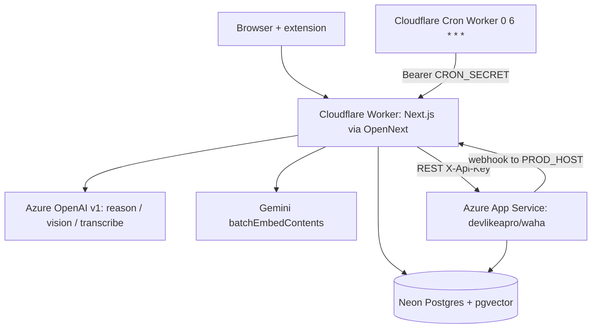

# Azure + Cloudflare hosting: what is left to do

## Context

The literal ask: review `docs/plans/2026-09-16-1815-chore-azure-cloudflare-deployment-plan.md`, report what still needs doing, and fold in three directives — Next.js frontend on **Cloudflare**, WAHA on **Azure**, LLM inference on **Azure**.

Audit result: **nothing from that plan has been implemented**, and its central technical decision no longer matches the directives. Verified in this session: no `Dockerfile`, no `.dockerignore`, no `infra/` (glob miss), `next.config.ts` has only the legacy `*.html` redirects (no `output: "standalone"`), `vercel.json` still declares the `nextjs` framework plus the `0 6 * * *` cron, `src/app/api/health/route.ts:83` still reads `process.env.VERCEL_GIT_COMMIT_SHA`, `package.json` still has `"env:pull": "vercel env pull .env.local"`, `src/lib/server/env.ts:8,14` still require `NVIDIA_API_KEY` / default `NIM_BASE_URL`, and `src/lib/server/auth-server.ts:5,45` still constructs `new Pool` from `pg`. So every unit (U1–U5) of the old plan is unstarted, and three of its decisions are now void: KTD1 (full Next server on Azure Container Apps), KTD2 (Cloudflare as proxy-only), and its "NIM stays / WAHA stays put" assumptions (OQ1).

End state: the Next.js app runs on Cloudflare Workers through `@opennextjs/cloudflare` on a Cloudflare custom domain; all inference (transcription, vision, reasoning) goes to an Azure AI Foundry (Azure OpenAI) resource over its OpenAI-compatible `v1` API; WAHA runs always-on as a container on Azure App Service with its session state in Neon; the nightly sweep fires from a Cloudflare Cron Trigger. Neon Postgres and Gemini embeddings stay where they are.

This plan replaces the 2026-09-16 plan. No Dockerfile is produced anywhere: the app is a Worker, and WAHA uses the upstream `devlikeapro/waha` image.

## Inputs the implementer fills in

Fill these once, then use them verbatim throughout. Defaults are given where a value is free.

| Placeholder | Meaning | Default / how to pick |
|---|---|---|
| `<PROD_HOST>` | public hostname | a hostname on a Cloudflare zone in the same account, e.g. `app.earcue.com`. If no zone exists yet, use the `workers.dev` URL `earcue.<subdomain>.workers.dev` and set `BETTER_AUTH_URL` to it |
| `<AOAI_RESOURCE>` | Azure OpenAI / Foundry resource name | create in a region carrying `gpt-4.1`, `gpt-4.1-mini`, `gpt-4o-transcribe` (e.g. `eastus2`) |
| `<AZ_RG>` | Azure resource group | `earcue-rg` |
| `<WAHA_APP>` | App Service app name | `earcue-waha` (public URL becomes `https://earcue-waha.azurewebsites.net`) |
| `<NEON_DIRECT_URL>` | Neon **unpooled** connection string | Neon console → connection string with "Pooled connection" off, `?sslmode=require` |

Cloudflare **Workers Paid** ($5/mo) is a hard prerequisite: the Free plan caps CPU at 10 ms per request and 50 subrequests, which this app's SSR plus LLM JSON parsing exceeds (Workers limits doc, verified). Paid gives 30 s CPU default, raisable to 300 s.

## Target topology



## Approach

Steps 1 and 2 are code-only and verifiable with `next dev`; do them first, in order. Step 3 packages for Workers. Steps 4–6 are deployment and can be done in the listed order; step 6 (WAHA) depends only on step 4 having produced a public URL.

### 1. Move all inference to Azure OpenAI

Azure's v1 API is OpenAI-shaped: `POST https://<AOAI_RESOURCE>.openai.azure.com/openai/v1/chat/completions` with `Authorization: Bearer <key>` and no `api-version` (verified against Microsoft's v1 API doc). So `chat`/`chatJson` need only a base-URL/key/model swap. Transcription is the one real change: the current call sends `{ type: "audio_url", audio_url: { url: "data:..." } }` through chat completions (`src/app/api/ingest/audio/route.ts:77`), which Azure does not accept; Azure's transcription path is `POST /openai/v1/audio/transcriptions`, multipart, and accepts mp3/mp4/mpeg/mpga/m4a/wav/**webm** up to 25 MB (verified) — the client only ever produces `audio/webm` (`src/lib/client/pipeline.ts:44`) or `audio/wav` (`src/lib/client/capture.ts:406`), both supported.

1. In the Azure portal / `az`, create the Foundry (Azure OpenAI) resource `<AOAI_RESOURCE>` and three model deployments, named exactly:
   - `earcue-reason` → base model `gpt-4.1`
   - `earcue-vision` → base model `gpt-4.1-mini` (image input; used for one frame per call)
   - `earcue-transcribe` → base model `gpt-4o-transcribe`
   With the v1 API the `model` field is the **deployment name**, which is why the env defaults below are deployment names, not model ids.
2. `src/lib/server/env.ts`: in `REQUIRED_ENV` replace `"NVIDIA_API_KEY"` with `"AZURE_OPENAI_API_KEY"` and add `"AZURE_OPENAI_BASE_URL"` (no sane default exists — it embeds the resource name). In `ENV_DEFAULTS` delete `NIM_BASE_URL` and set:
   ```ts
   MODEL_TRANSCRIBE: "earcue-transcribe",
   MODEL_VISION: "earcue-vision",
   MODEL_REASON: "earcue-reason",
   ```
   Leave `GEMINI_BASE_URL` / `MODEL_EMBED` untouched: `memories.embedding` is `vector(768)` written by `gemini-embedding-001`, and re-embedding every stored memory is not part of this move.
3. Rename `src/lib/server/nim.ts` → `src/lib/server/llm.ts` using `lsp` `rename_file` so the eight importers are rewritten by the server, not by hand: `src/app/api/factcheck/route.ts`, `src/app/api/ingest/audio/route.ts`, `src/app/api/ingest/frames/route.ts`, `src/app/api/watch/route.ts`, `src/lib/server/knowledge.ts`, `src/lib/server/review.ts`, `src/lib/server/assist/meetings.ts`, `src/lib/server/assist/suggest.ts`. Inside the renamed file:
   - `fetch(\`${env.AZURE_OPENAI_BASE_URL}/chat/completions\`)` with `authorization: \`Bearer ${env.AZURE_OPENAI_API_KEY}\``.
   - Rewrite the four thrown/message literals: `"llm: deadline exceeded"`, `` `llm ${res!.status}: ${body}` ``, `"llm: model returned no content"`, `"llm: request failed"`.
   - `recordUsage` writes `llm_usage_daily` (table renamed in step 1.6) and logs `logError("llm_usage_record_failed", ...)`.
   - Add the transcription client next to `chat`, reusing `RETRY_STATUS`, `recordUsage` and `EmptyCompletion`:
     ```ts
     const AUDIO_EXT: Record<string, string> = {
       "audio/webm": "webm",
       "audio/mp4": "mp4",
       "audio/mpeg": "mp3",
       "audio/wav": "wav",
     };

     export interface TranscribeOptions {
       model: string;
       audio: Uint8Array;
       mime: string;
       deadlineMs?: number;
     }

     // Azure infers the audio format from the uploaded filename, so the extension must match `mime`.
     // Transcription responses carry no OpenAI-shaped `usage`, so only the request is counted.
     export async function transcribe({ model, audio, mime, deadlineMs = 45000 }: TranscribeOptions): Promise<string>
     ```
     Behaviour: up to 2 attempts; each attempt builds `FormData` with `file` = `new File([audio], \`chunk.${AUDIO_EXT[mime] ?? "webm"}\`, { type: mime })`, `model`, `response_format: "json"`; POST to `${env.AZURE_OPENAI_BASE_URL}/audio/transcriptions` with only the `authorization` header (let `fetch` set the multipart boundary) and `signal: AbortSignal.timeout(remaining)`; call `recordUsage(model, null)` on every answered attempt; retry only on `RETRY_STATUS`; throw `EmptyCompletion("llm: transcription returned no text")` when the response `text` is blank, so the existing `catch` in the audio route still answers `{ turns: [] }`.
4. `src/app/api/ingest/audio/route.ts`: drop `audio/ogg` from `MIME_ALLOW` (Azure does not list ogg, and no client path emits it), delete the `ASR_SYSTEM` constant, the `dataB64` base64 conversion and the `chat(...)` block, and call `text = (await transcribe({ model: env.MODEL_TRANSCRIBE, audio: raw, mime, deadlineMs: 45000 })).trim();` inside the existing `try`. Keep `readRawBody`, the 8 MB cap, `consume(user, "audio_seconds", billedSeconds)` ordering and the `EmptyCompletion` branch exactly as they are. Replace the stale comment at line 18 with one naming Azure's format list as the reason `MIME_ALLOW` stays bare.
5. `src/app/api/health/route.ts`: `costReport()` selects `from llm_usage_daily` (both queries); rename the destructured `nim` binding and the response field to `llm` (`const [stale, llm] = ...`, `...(authorized ? { missing, stale, llm } : {})`). Also change `release` to `process.env.COMMIT_SHA || "dev"` — the Vercel var is gone and `COMMIT_SHA` is injected at deploy in step 3.
6. New `db/migrations/015_llm_usage_rename.sql` (migration numbering: 014 is the highest today):
   ```sql
   -- NVIDIA NIM was replaced by Azure OpenAI; the table is provider-neutral now.
   alter table nim_usage_daily rename to llm_usage_daily;
   ```
   Apply with `npm run migrate`.
7. `scripts/dev-doctor.mjs:14`: swap `"NVIDIA_API_KEY"` for `"AZURE_OPENAI_API_KEY"` and add `"AZURE_OPENAI_BASE_URL"` to `REQUIRED`; rewrite the `NVIDIA_API_KEY` special-case branch (lines 18–19) to key off `AZURE_OPENAI_API_KEY` and tell the reader to add the value to `.env.local` (there is no `env:pull` after step 3).
8. `.env.example`: replace `NVIDIA_API_KEY=` with `AZURE_OPENAI_API_KEY=`, replace the `NIM_BASE_URL=` line with `AZURE_OPENAI_BASE_URL= # https://<resource>.openai.azure.com/openai/v1`, and update the three `MODEL_*` default comments to the deployment names from step 1.1.

### 2. Make the two server-side Postgres paths Workers-safe

`src/lib/server/db.ts` already uses the Neon HTTP driver, which runs on Workers unchanged. The blocker is `src/lib/server/auth-server.ts:45`: better-auth needs a real pool, and `pg` needs raw TCP, which Workers do not give it. `@neondatabase/serverless` — already a dependency — exposes a `Pool` over WebSockets that Neon documents as a node-postgres drop-in for Cloudflare Workers (verified in Neon's serverless-driver doc).

1. `src/lib/server/auth-server.ts`: change `import { Pool } from "pg";` to `import { Pool } from "@neondatabase/serverless";`. Keep the constructor options as they are (`connectionString`, `max: 1`, `idleTimeoutMillis: 10000`, `connectionTimeoutMillis: 5000`). Replace the two-line comment above it with: better-auth's Kysely adapter needs a pool, Workers have no raw TCP for `pg`, and Neon's WebSocket `Pool` is node-postgres-compatible — `db.ts` keeps the HTTP driver for everything else, so the two independent access paths still exist by design.
2. `package.json`: move `"pg": "^8.23.0"` from `dependencies` to `devDependencies` (only `scripts/migrate.mjs`, `scripts/dev-doctor.mjs` and `scripts/dev-token.mjs` still import it, all plain Node) and delete `"@types/pg"` (nothing typed uses it once `auth-server.ts` imports Neon's own types). This also keeps `pg` out of the Worker bundle.

### 3. Package the app for Cloudflare Workers

`@opennextjs/cloudflare` supports every Next.js 16 minor and Turbopack builds, and requires `next >= 16.2.11` on the 16 line (this repo is on `^16.3.5`). It runs the Node.js runtime, not the edge runtime, so no route needs rewriting; the repo has no `middleware.ts`, no `revalidate`/`use cache`/ISR usage and no `export const runtime`, so no incremental-cache binding (R2/KV) is needed.

1. `npm install --save-dev @opennextjs/cloudflare@latest wrangler@latest`.
2. New `wrangler.jsonc` at the repo root:
   ```jsonc
   {
     "$schema": "node_modules/wrangler/config-schema.json",
     "name": "earcue",
     "main": ".open-next/worker.js",
     "compatibility_date": "2026-09-01",
     "compatibility_flags": ["nodejs_compat", "global_fetch_strictly_public"],
     "assets": { "directory": ".open-next/assets", "binding": "ASSETS" },
     "services": [{ "binding": "WORKER_SELF_REFERENCE", "service": "earcue" }],
     "observability": { "enabled": true },
     "limits": { "cpu_ms": 300000 },
     "routes": [{ "pattern": "<PROD_HOST>", "custom_domain": true }],
     "vars": {
       "BETTER_AUTH_URL": "https://<PROD_HOST>",
       "AZURE_OPENAI_BASE_URL": "https://<AOAI_RESOURCE>.openai.azure.com/openai/v1",
       "MODEL_REASON": "earcue-reason",
       "MODEL_VISION": "earcue-vision",
       "MODEL_TRANSCRIBE": "earcue-transcribe",
       "WAHA_BASE_URL": "https://<WAHA_APP>.azurewebsites.net",
       "BILLING_ENABLED": "0"
     }
   }
   ```
   `limits.cpu_ms` is raised because `/api/cron/review-sweep` runs a ~50 s budget of LLM work; waiting on `fetch` does not count as CPU, but the JSON parsing across a 200-row sweep can. Drop the `routes` block and rely on the `workers.dev` URL if `<PROD_HOST>` is not yet on a Cloudflare zone.
3. New `open-next.config.ts`:
   ```ts
   import { defineCloudflareConfig } from "@opennextjs/cloudflare";

   // No ISR, no `use cache`, no `revalidate` in this app, so no incremental-cache binding.
   export default defineCloudflareConfig();
   ```
   Add `"open-next.config.ts"` to the `include` array in `tsconfig.json` (it is an allowlist; `.open-next` output stays out of `tsc` because it is not listed).
4. `next.config.ts`: keep the redirects and append, after the default export:
   ```ts
   import { initOpenNextCloudflareForDev } from "@opennextjs/cloudflare";
   initOpenNextCloudflareForDev();
   ```
5. New `public/_headers` (the repo has no `public/` directory yet):
   ```
   /_next/static/*
     Cache-Control: public,max-age=31536000,immutable
   ```
6. `package.json` scripts: delete `"env:pull"` (Vercel is gone; `.env.local` is now written by hand from `.env.example`) and add:
   ```json
   "preview": "opennextjs-cloudflare build && opennextjs-cloudflare preview",
   "deploy": "opennextjs-cloudflare build && opennextjs-cloudflare deploy -- --keep-vars --var COMMIT_SHA:$(git rev-parse HEAD)",
   "cf-typegen": "wrangler types --env-interface CloudflareEnv cloudflare-env.d.ts"
   ```
   `--keep-vars` stops a deploy from wiping dashboard-set vars; `--var` injects the release SHA that step 1.5 now reads. Both flags are documented on `wrangler deploy`.
7. Delete `vercel.json`. Add `.open-next`, `.dev.vars` and `cloudflare-env.d.ts` to `.gitignore` (`.env*` does not cover `.dev.vars`). Create a local, untracked `.dev.vars` containing `NEXTJS_ENV=development` so `npm run preview` loads `.env.development`/`.env.local` the way `next dev` does.
8. Delete the eight now-inert `export const maxDuration = 60;` lines — Workers have no per-route duration config and there is no Vercel deployment left to read them: `src/app/api/assist/[action]/route.ts:8`, `src/app/api/connect/[action]/route.ts:4`, `src/app/api/cron/review-sweep/route.ts:10`, `src/app/api/factcheck/route.ts:9`, `src/app/api/ingest/audio/route.ts:10`, `src/app/api/ingest/frames/route.ts:8`, `src/app/api/review/route.ts:8`, `src/app/api/watch/route.ts:9`. Reword the two comments that justify themselves by Vercel limits: the "Vercel's Hobby plan caps a deployment at 12 functions" note above the `assist` dispatcher map and the `maxDuration` mention in `src/lib/server/waha.ts:41` (the 15 s `AbortSignal.timeout` still matters — it stops a hung WAHA from holding a request open). The dispatchers themselves stay; Workers have no function-count cap but splitting them buys nothing.

### 4. Deploy the Worker and cut the domain over

1. `npm run build` then `npm run preview`, and exercise `http://localhost:8787/api/health` before touching Cloudflare — this is the first run inside `workerd` and the cheapest place to catch a Node-API gap. `node:crypto` is fully supported on Workers except DSA/DH keygen, argon2, ed448/x448 and FIPS toggling, so `src/lib/server/secretbox.ts`'s `createCipheriv("aes-256-gcm", …)` and the `createHash`/`randomBytes`/`timingSafeEqual` uses in `auth.ts`, `connect.ts`, `knowledge.ts`, `assist/suggest.ts` and `assist/tokens.ts` need no rewrite.
2. Upload secrets (never as `vars`): `npx wrangler secret bulk .env.production` with an untracked `.env.production` holding `DATABASE_URL` (Neon **pooled**), `BETTER_AUTH_SECRET`, `CRON_SECRET`, `AZURE_OPENAI_API_KEY`, `GEMINI_API_KEY`, `CONNECTOR_ENC_KEY`, `WAHA_API_KEY`, plus `GOOGLE_CLIENT_ID`/`GOOGLE_CLIENT_SECRET` and `SLACK_CLIENT_ID`/`SLACK_CLIENT_SECRET` if those connectors are wanted. Leave `BILLING_ENABLED=0` and add the three `POLAR_*` secrets only when all three are real — `billingEnabled()` in `env.ts` exists because a half-configured Polar 500s sign-up.
3. `npm run deploy`. Cloudflare provisions the custom-domain DNS record and certificate for `<PROD_HOST>`; no origin, no proxy mode, no cache rules and no WAF exclusions are needed, because the Worker *is* the origin and Workers do not cache responses unless the code asks. The only caching config is `public/_headers` from step 3.5.
4. Re-point the extension: in `extension/options.html`'s stored settings, set the API base to `https://<PROD_HOST>` and mint a fresh ingest token (`npm run dev:token` against production env, or the settings sheet in `/app`). `extension/background.js` talks to the same `begin`/`browser`/`items`/`finish` actions, which already answer CORS preflight.
5. Rollback path: `npx wrangler deployments list` then `npx wrangler rollback <VERSION_ID>` puts the previous version back on all routes immediately.

### 5. Replace the Vercel cron with a Cloudflare Cron Trigger

Keep this out of the app Worker so the OpenNext entrypoint stays stock.

1. New `infra/sweep-cron/wrangler.jsonc`:
   ```jsonc
   {
     "$schema": "node_modules/wrangler/config-schema.json",
     "name": "earcue-sweep-cron",
     "main": "src/index.ts",
     "compatibility_date": "2026-09-01",
     "observability": { "enabled": true },
     "triggers": { "crons": ["0 6 * * *"] },
     "vars": { "SWEEP_URL": "https://<PROD_HOST>/api/cron/review-sweep" }
   }
   ```
   Same UTC schedule as the deleted `vercel.json` entry.
2. New `infra/sweep-cron/src/index.ts`:
   ```ts
   interface Env {
     SWEEP_URL: string;
     CRON_SECRET: string;
   }

   export default {
     async scheduled(_event: ScheduledController, env: Env) {
       const res = await fetch(env.SWEEP_URL, {
         headers: { authorization: `Bearer ${env.CRON_SECRET}` },
       });
       const body = await res.text();
       console.log(JSON.stringify({ event: "sweep_triggered", status: res.status, body: body.slice(0, 500) }));
       if (!res.ok) throw new Error(`sweep failed: ${res.status}`);
     },
   } satisfies ExportedHandler<Env>;
   ```
   Throwing on non-2xx is what surfaces a failed sweep in the Worker's invocation log; the route is idempotent (its completed-status guard), so a manual re-run is safe.
3. `npx wrangler secret put CRON_SECRET -c infra/sweep-cron/wrangler.jsonc` with the same value the app Worker holds, then `npx wrangler deploy -c infra/sweep-cron/wrangler.jsonc`.

### 6. Run WAHA on Azure App Service, with its sessions in Neon

WAHA's own facts (already researched in `.wayfinder/research/002-waha-facts.md` and re-confirmed against `waha.devlike.pro`): one free image `devlikeapro/waha`, port 3000, API guarded by `X-Api-Key` from `WAHA_API_KEY`, local sessions need a volume at `/app/.sessions`, **or** `WHATSAPP_SESSIONS_POSTGRESQL_URL` puts session state in Postgres — supported for WEBJS, NOWEB and GOWS. Postgres-backed sessions are the choice here: App Service's own guidance says not to put SQLite or lock-dependent state on a mounted Azure Files share, and a WEBJS Chromium profile is exactly that. Engine stays the default **WEBJS**, because `normalizeWahaMessage()` in `src/lib/server/waha.ts` reads `msg._data.notifyName`, which is WEBJS-shaped, and switching engines also invalidates existing session auth.

1. Create the plan and app:
   ```bash
   az group create -n <AZ_RG> -l eastus2
   az appservice plan create -g <AZ_RG> -n earcue-plan --is-linux --sku B1
   az webapp create -g <AZ_RG> -p earcue-plan -n <WAHA_APP> \
     --deployment-container-image-name docker.io/devlikeapro/waha:latest
   az webapp config set -g <AZ_RG> -n <WAHA_APP> --always-on true
   ```
2. App settings (`az webapp config appsettings set -g <AZ_RG> -n <WAHA_APP> --settings ...`): `WEBSITES_PORT=3000`, `WHATSAPP_DEFAULT_ENGINE=WEBJS`, `WHATSAPP_SESSIONS_POSTGRESQL_URL=<NEON_DIRECT_URL>`, `WAHA_API_KEY=<generated 32-hex key>`, `WAHA_DASHBOARD_USERNAME` / `WAHA_DASHBOARD_PASSWORD`, `WHATSAPP_SWAGGER_USERNAME` / `WHATSAPP_SWAGGER_PASSWORD`. The dashboard/swagger credentials matter because the app is publicly reachable — WAHA generates random secrets at startup otherwise, and the API key is the only access control available (Workers egress has no stable IP range to allowlist).
3. Wire the app Worker to it: `WAHA_BASE_URL=https://<WAHA_APP>.azurewebsites.net` as a `var` (step 3.2), `WAHA_API_KEY` as a secret (step 4.2). Leave `WAHA_WEBHOOK_BASE_URL` **unset** — `webhookUrl()` falls back to `BETTER_AUTH_URL`, which is the public Cloudflare HTTPS URL and is reachable from Azure. The WhatsApp connector only appears when `CONNECTOR_ENC_KEY`, `WAHA_BASE_URL` and `WAHA_API_KEY` are all set (`connectorsEnabled()` in `env.ts`).
4. Link the real session: `curl -H "X-Api-Key: <key>" https://<WAHA_APP>.azurewebsites.net/api/sessions` must answer `[]` (and `401` without the header) before touching the UI; then use the settings sheet in `/app` to link, scan the QR inside 60 s, and poll to `WORKING`.

### 7. Land the documentation the move invalidates

Repo policy (`AGENTS.md`) is that hosting/env/ops docs change in the same commit. Concretely: `AGENTS.md` — the Development Commands block (`env:pull` gone, `preview`/`deploy` added), the required-env list (`AZURE_OPENAI_API_KEY`, `AZURE_OPENAI_BASE_URL`), the migrations table (add row 015, bump "next one is `016_...`"), the `nim.ts`/`nim_usage_daily`/health-`nim` references, and the Vercel-specific notes (12-function cap, `maxDuration`, cron). `README.md` — the `NVIDIA_API_KEY`/`vercel env add` paragraph (lines 79–83) and the `/api/health` `nim` paragraph (lines 115–116). `docs/plans/2026-09-16-1815-chore-azure-cloudflare-deployment-plan.md` — mark superseded, pointing at this plan's committed copy.

## Critical files & anchors

| File | Anchor | Why |
|---|---|---|
| `src/lib/server/nim.ts` → `llm.ts` | `chat()` fetch at :68–75, `recordUsage()` at :34 | every provider literal lives here; `transcribe()` is added beside `chat()` |
| `src/app/api/ingest/audio/route.ts` | `MIME_ALLOW` :19, `chat(...)` :69–83 | the only modality that changes endpoint shape, not just base URL |
| `src/lib/server/auth-server.ts` | `new Pool` :45 and the comment above it | second, independent Postgres path; the one thing `pg` was still needed for |
| `src/app/api/health/route.ts` | `release` :83, `costReport()` :57–67, response spread :98 | release SHA source and the renamed usage table/field |
| `src/lib/server/env.ts` | `REQUIRED_ENV` :3–10, `ENV_DEFAULTS` :12–49 | required-vs-defaulted split drives `/api/health` and `dev:doctor` |

## Verification

Prerequisites: run from the repo root; `.env.local` hand-authored from `.env.example` with the Azure values; `npm run migrate` applied against `DATABASE_URL`; `npx wrangler login` and `az login` done.

1. **Static gates** — `npm run typecheck && npm test && npm run lint && npm run build`. Expect zero errors; the `oxlint` run matters because `shadcn/*` rules fail the build on style drift, and `build` is what OpenNext will invoke.
2. **Azure inference, locally, before any deploy** — `npm run dev:up`, then with a seeded session cookie or ingest token:
   - Reasoning: `curl -s localhost:3000/api/factcheck -H "content-type: application/json" -b cookies.txt -d '{"claim":"The Eiffel Tower is in Berlin","context":""}'` returns a JSON verdict body (not a 5xx) — proves `chat`/`chatJson` against `earcue-reason`.
   - Transcription + vision + watch: open `http://localhost:3000/app`, start All-day capture with mic and screen share, speak two distinct sentences, wait for one flush. Expect a `speech` trace row carrying those words in the Day view and a `screen` caption row. This is the only proof that `transcribe()`'s multipart shape and filename-extension mapping are right; a silent fixture yields an empty transcript and proves nothing.
   - `curl -s localhost:3000/api/health -H "Authorization: Bearer $CRON_SECRET" | jq '.llm'` shows non-zero `requests` split by the three deployment names — proves migration 015 plus `recordUsage`.
3. **Worker runtime** — `npm run preview`, then `curl -s localhost:8787/api/health` returns `{"ok":true,...,"missingCount":0}`, and signing in at `http://localhost:8787/signin` succeeds. Sign-in is the decisive check for the Neon `Pool` swap: better-auth failing here means the pool, not the app.
4. **Production smoke through `<PROD_HOST>`** — after `npm run deploy`:
   - `curl -s https://<PROD_HOST>/api/health` → 200, `release` equal to the deployed commit SHA (not `dev`).
   - `curl -sI https://<PROD_HOST>/_next/static/<any-hashed-asset>` → `cache-control: public,max-age=31536000,immutable`.
   - Sign in, run one capture flush, generate a day review.
   - Extension sync: trigger a history sync from the extension options page and confirm a `completed` row in `imports` plus `stale` clean in the authorized health payload.
5. **Cron** — `npx wrangler dev -c infra/sweep-cron/wrangler.jsonc --test-scheduled` then `curl "http://localhost:8787/__scheduled?cron=0+6+*+*+*"` logs `sweep_triggered` with `status: 200`. After deploy, confirm `401` for `curl -s https://<PROD_HOST>/api/cron/review-sweep` without the bearer header, and a success payload with it.
6. **WAHA** — `curl -H "X-Api-Key: <key>" https://<WAHA_APP>.azurewebsites.net/api/sessions` returns `[]` (and `401` bare); link the session to `WORKING`; send yourself one WhatsApp message and confirm a new `context_items` row lands within ~60 s (WAHA's retry window is ~62–75 s and delivery is best-effort, so a miss is closed by the backfill, not by waiting); restart the App Service app (`az webapp restart`) and confirm the session returns to `WORKING` without a new QR — that is the Neon-backed session store doing its job.

## Assumptions & contingencies

- **Cloudflare Workers Paid is purchased.** If it is not, stop: the Free plan's 10 ms CPU ceiling and 50-subrequest cap make this app unservable, and no code change fixes that.
- **`<PROD_HOST>` sits on a Cloudflare zone in the same account.** If it does not yet, deploy without the `routes` block, set `BETTER_AUTH_URL` and `SWEEP_URL` to the `workers.dev` URL, verify everything there, then add the custom domain and update both values — `BETTER_AUTH_URL` also feeds `trustedOrigins`, so a stale value breaks sign-in site-wide.
- **Neon's role can `CREATE DATABASE`.** WAHA's Postgres session store uses one database per session (`waha_{namespace}_{session}`), which needs a direct (non-pooled) connection and `CREATEDB`. If WAHA logs a permission or "cannot run inside a transaction block" error at startup, fall back to local file storage: create a storage account plus file share, `az webapp config storage-account add ... --mount-path /sessions`, and set `WAHA_LOCAL_STORE_BASE_DIR=/sessions` — WAHA documents that exact variable as the workaround for Azure's dot-directory restriction. Keep the app at one instance in that case.
- **better-auth accepts Neon's `Pool` directly.** If sign-in fails on Workers with a closed-socket or dialect error, in order: (a) set `neonConfig.poolQueryViaFetch = true` in `auth-server.ts` before constructing the pool; (b) if that is not enough, `npm i kysely` and pass `database: { dialect: new PostgresDialect({ pool }), type: "postgres" }` instead of the bare pool; (c) as a last resort, stop caching the instance in `getAuth()` so each request builds its own pool. Do not reintroduce `pg`.
- **`gpt-4.1` / `gpt-4.1-mini` / `gpt-4o-transcribe` are deployable in the chosen region.** If one is not, pick the nearest equivalent in the same resource (any vision-capable chat model for `earcue-vision`, `whisper` for `earcue-transcribe`) and keep the deployment *names* — the code only ever sends deployment names, so no code changes.
- **Embeddings stay on Gemini.** Moving them to an Azure embedding model would invalidate every existing `memories.embedding` row and require a full re-embed; that is a separate decision, not part of this move.
