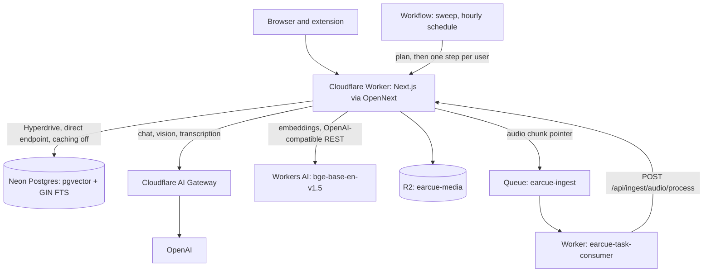
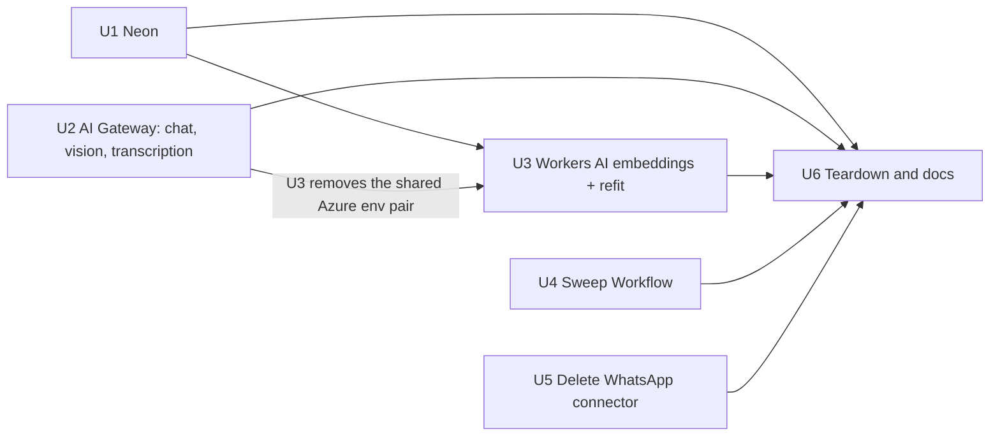
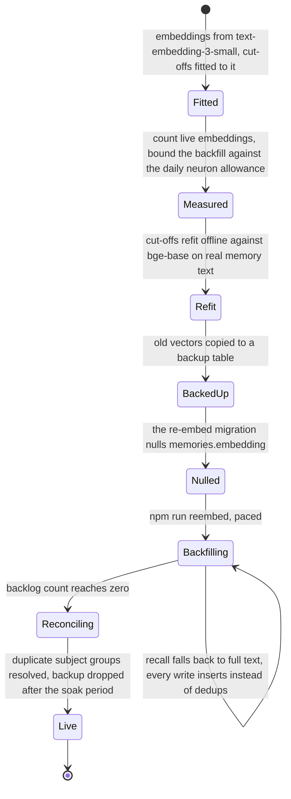

# Exit Azure for Cloudflare - Plan

## Goal Capsule

- **Objective:** an operator keeps earcue running without provisioning or tuning infrastructure — no database server to size, no model deployments to name, no resource group to maintain, and no connector wired to a host that does not exist. Capture still transcribes, the nightly review still lands, and recall returns the same memories.
- **Means:** Neon behind the existing Hyperdrive binding, OpenAI through a Cloudflare AI Gateway for reasoning, vision and transcription, Workers AI for embeddings, a scheduled Workflow in place of the sweep cron Worker, and deletion of the WhatsApp connector (KTD1, KTD3, KTD4, KTD6, and Key Decision KD1).
- **Authority:** the two decisions the user settled this session — remove the WhatsApp connector, stay on Workers Free — outrank any design that would reverse them. `AGENTS.md` conventions outrank generic deployment guides. Official Cloudflare, Neon and OpenAI documentation outranks community posts. Where this plan is silent, current behavior is the reference.
- **Execution profile:** provider swaps behind seams that already exist, plus one live data migration. Prefer runtime smoke proof over new unit coverage; the only units that earn real tests are the ones changing pure functions and request shapes.
- **Stop conditions:** stop and ask if the Azure server will not take `wal_level=logical` without an unacceptable restart; if AI Gateway rejects a multipart transcription request and the direct-OpenAI fallback is also unacceptable; if no refit of the two cosine cut-offs keeps dedup and recall behaving; if the measured re-embed backlog would take longer than a day at the free neuron allowance; or if a `WorkflowEntrypoint` class cannot be bundled into the OpenNext Worker output.
- **Who finishes:** one implementer holding Cloudflare, Neon, Azure and OpenAI account access, landing U1 through U6 as separate PRs.

---

## Product Contract

### Summary

Remove every Azure dependency. The database moves to Neon and keeps its current access path untouched — Cloudflare's own Neon guide prescribes exactly the `pg`-over-Hyperdrive shape the repo already uses. Reasoning, vision and transcription move to OpenAI behind a Cloudflare AI Gateway, which deletes the Azure-specific legacy audio path along the way. Embeddings move to Workers AI, where `@cf/baai/bge-base-en-v1.5` happens to output the same 768 dimensions the schema already stores. The hourly sweep becomes a scheduled Cloudflare Workflow and its helper Worker and queue go away; the audio ingest queue stays, because Cloudflare's guidance is that a single idempotent consumer belongs on Queues. The WhatsApp connector is deleted rather than rehosted.

This is not a uniform simplification and the plan does not claim one. Azure disappears, one Worker and one queue pair disappear, and a permanently broken connector disappears. In exchange the system gains a second inference provider with its own quota and its own failure shape, and one orchestration primitive it does not use anywhere else. The moving-parts accounting is in System-Wide Impact.

### Problem Frame

earcue runs on Cloudflare but depends on Azure in three places, and each one costs something different.

The database is an Azure Postgres server reached through a Cloudflare Hyperdrive binding. It got there by accident of debugging, not by design: commit `0c43af9` moved the app off Neon to fix intermittent sign-in and read hangs, and the commit message shows the fault was a client-side pool stacked on Hyperdrive's own pool. The fix that stuck — one `pg.Client` per query, closed immediately — has nothing to do with which Postgres sits behind Hyperdrive. Commit `a3f4173`, which names Azure Postgres, changed no application code at all.

Inference runs against one Azure OpenAI resource with four deployments. Azure's OpenAI-compatible `v1` surface does not route audio, so `src/lib/server/llm.ts` carries a second code path for transcription alone: a legacy deployment URL, a pinned api-version, and `api-key` auth instead of a bearer.

WAHA, the WhatsApp bridge, was never deployed. `wrangler.jsonc:33` still holds the literal placeholder `https://<WAHA_APP>.azurewebsites.net`. The connector is worse than absent: `connectorsEnabled().whatsapp` and `connect.ts`'s own `wahaEnabled()` gate both pass whenever `CONNECTOR_ENC_KEY`, `WAHA_API_KEY` and `WAHA_BASE_URL` are all set, and the placeholder satisfies the third. With those secrets deployed the UI offers linking, `handleWhatsappLink` writes a `connections` row, the call to the placeholder host fails, and `/api/health` then polls that unreachable host forever.

### Key Decisions

- KD1. The WhatsApp connector is removed, not rehosted or re-platformed (session-settled: user-directed — chosen over rehosting WAHA on always-on compute or swapping to Meta's Cloud API: Meta's Cloud API and Twilio cannot read a personal account's existing chats, and no Cloudflare product can host a stateful WhatsApp Web session, so keeping the capability means paying for and babysitting a box outside Cloudflare). Governs R11, R12, R13.

### Requirements

**Database**

- R1. The application database is a Neon project reached through the existing Hyperdrive binding, with `pgcrypto`, `pgvector`, the HNSW index, the generated tsvector columns and `memory_strength()` all present and behaving as before.
- R2. Moving the data costs at most a short read-only window, after which every table's row count, every sequence's next value, the `schema_migrations` ledger, a pgvector nearest-neighbour query and a full-text search return what they returned before the move.
- R3. Reaching the new database needs no application code change: `src/lib/server/db.ts` and `src/lib/server/auth-server.ts` keep their per-query client shape.

**Inference**

- R4. Reasoning and vision go to OpenAI through a Cloudflare AI Gateway, preserving the existing chat request shape, retry policy, deadline handling and JSON-mode fallback.
- R5. Transcription goes to the same gateway over OpenAI's standard `/audio/transcriptions` endpoint, and the Azure-only legacy deployment path, its pinned api-version and its `api-key` header are gone.
- R6. Memory embeddings come from Workers AI `@cf/baai/bge-base-en-v1.5`, so `memories.embedding` stays `vector(768)` and the HNSW index is not rebuilt.
- R7. Every inference call still meters into `llm_usage_daily` per day, model and user, and still refuses past `DAILY_TOKEN_CEILING`.
- R8. `MEMORY_DEDUP_SIM` and `RECALL_MIN_SIM` are refit to the new embedding model before it serves production traffic; no memory row is left permanently unembedded; and any duplicate memory the backfill window creates is found and resolved.

**Background work**

- R9. The hourly sweep runs from a scheduled Cloudflare Workflow with no separate cron Worker: one durable step plans the due users, and each user's review or distill gets its own retryable step.
- R10. A user whose review is already running is not planned again on the next hour, and a night where no review completes is visible on the authorized health branch.

**WhatsApp**

- R11. The WAHA connector is gone: no module, no dispatcher actions, no environment variables, no UI control, no `connections` rows, and no partial index serving its webhook lookup.
- R12. After removal, `/api/health` returns healthy on a database that previously held a WhatsApp connection row.
- R13. Importing a WhatsApp chat export (`.txt`) still works and still produces the same memories.

**Operability and documentation**

- R14. No Azure account, resource, key or URL remains in the repository, in the Worker configuration, or in the deployed environment.
- R15. `AGENTS.md`, `README.md`, `.env.example`, every generated diagram and the privacy page describe the new providers, updated in the same commits that change them.

### Scope Boundaries

**In scope:** the database provider, the inference providers, the sweep's scheduling plumbing, deletion of the WhatsApp connector, the environment and configuration surface each of those touches, and the documentation each one invalidates.

**Deferred to follow-up work:**

- Dead-letter-queue depth and orphaned-R2-object visibility on `/api/health`. Both are real blind spots, and both need the Cloudflare API rather than a binding.
- A Workers AI neuron meter in the application. The 10,000-per-day allowance is invisible to `assertUnderCeiling`, which is a gap this plan documents rather than closes.
- Wrapping `runDistillPass`'s memory, edge and cursor writes in `withTransaction`. The gap predates this plan; see System-Wide Impact for why U3 and U4 make it sharper without making it this plan's job.
- Neon branch-per-PR integration tests. The suite has no database-backed test today, so this is new infrastructure with no existing consumer.
- Moving the audio ingest path to Workflows. KTD6 explains why it stays on Queues.
- Disabling Neon autosuspend. Worth revisiting only if cold starts show up in practice.

**Out of scope:** capture behavior, quotas, billing, the browser extension, and every API request and response contract. None of them change.

### Open Questions

- OQ1 (blocks U2). Does AI Gateway proxy a multipart `POST /audio/transcriptions` to OpenAI? Cloudflare's OpenAI provider page documents the gateway as a drop-in replacement for the OpenAI base URL but enumerates only `/chat/completions` and `/responses`. Resolve with one smoke request before deleting the Azure path. Fallback: use `https://api.openai.com/v1` as the transcription base and keep the gateway for chat, losing transcription analytics only.
- OQ2 (blocks U1). What Postgres major version does the Azure server run, does its SKU allow the `wal_level=logical` restart in an acceptable window, and does that version's logical replication carry sequences? Neon's Azure migration guide asks for a version match. All three are facts about the live resource, not the repo.
- OQ3 (blocks U4). Can a `WorkflowEntrypoint` class be bundled into the `@opennextjs/cloudflare` Worker output alongside the default fetch handler? Cloudflare documents cross-Worker Workflow bindings, so the fallback is a separate Worker holding the class. That fallback is Worker-count-neutral — it trades `infra/sweep-cron/` for a Workflow host — so if it fires, reconsider KTD6's rejected alternative before proceeding.
- OQ4 (blocks U3's acceptance, not its start). Does the Workers AI OpenAI-compatible embeddings response carry a `usage` object? If it does not, `recordUsage` records a request with zero tokens and `DAILY_TOKEN_CEILING` stops seeing embedding volume at all. Either answer needs a sentence in the runbook; see System-Wide Impact.
- OQ5 (deferred, does not block). Does `bge-base-en-v1.5` return unit-normalized vectors? `embedTexts` normalizes client-side already, so this only affects how the refit numbers are interpreted.

---

## Planning Contract

### Key Technical Decisions

- KTD1. **Repoint Hyperdrive at Neon; change no database code.** Cloudflare's Neon guide tells you to use `pg` against Neon's direct, unpooled connection string precisely because Hyperdrive supplies the pooling, and it advises against `@neondatabase/serverless` on this path. That is the shape `src/lib/server/db.ts` already has. The earlier retreat from Neon was a double-pooling bug, not a Neon defect, so returning is safe as long as the per-query client discipline survives. Covers R1, R3.
- KTD2. **Move the data by logical replication, with dump-and-restore as the fallback.** Neon publishes a guide for Azure Postgres specifically. Replication brings the read-only window down to stopping writes, waiting for the subscription to catch up, and flipping the origin. `pg_dump`/`pg_restore` works too but pays for a full HNSW rebuild inside the window. Two things replication does not carry: sequence state, and any table a non-`FOR ALL TABLES` publication forgot. Both are cutover steps in U1, not afterthoughts. Covers R2.
- KTD3. **Point `chat`, `chatJson` and `transcribe` at OpenAI through AI Gateway, and delete the Azure audio path.** `chat()` already sends OpenAI's exact request shape with bearer auth, so this is a base URL, a key and three model ids. Transcription stops being special: OpenAI's `v1` surface routes `/audio/transcriptions`, which is the whole reason `transcribeUrl()`, `TRANSCRIBE_API_VERSION` and the `api-key` header exist. Covers R4, R5.
- KTD4. **Take Workers AI embeddings over its OpenAI-compatible `/v1/embeddings` endpoint, not the `AI` binding.** The binding does not exist outside a Worker, and `scripts/reembed-memories.ts`, `next dev` and the Vitest suite all call `embedTexts`. The REST endpoint keeps one code path for all four contexts and leaves `embed.ts` shaped as it is today — which also means no new readiness guard is needed, because there is no binding to be absent. `@cf/baai/bge-base-en-v1.5` outputs 768 dimensions natively, which is the only reason the schema survives: no Workers AI embedding model accepts a `dimensions` parameter. Covers R6.
- KTD5. **Stay on Workers Free, which is what sends transcription to OpenAI rather than Workers AI** (session-settled: user-directed — chosen over Workers Paid: Free and Paid share the same 10,000-neuron daily allowance and only Paid bills overage, so at roughly 46.6 neurons per audio-minute a single day of ambient capture would exhaust the account and every later call would fail). Embeddings still fit the free allowance in steady state; the one-time backfill is what has to be measured and paced. Covers R5, R6.
- KTD6. **Workflows replaces the sweep cron Worker and the `earcue-sweep` queue; the `earcue-ingest` queue stays.** A Workflow binding takes its own `schedules` array, so the hourly trigger needs no `scheduled` handler, and the sweep collapses to one scheduling mechanism with per-step retries visible in the Workflows dashboard rather than in a dead-letter queue. The audio path is the opposite shape — one already-idempotent step keyed on `client_id` as `<chunkId>#<i>` — and Cloudflare's guidance is Queues for a decoupled idempotent consumer, so converting it would add step billing and Free-plan concurrency exposure for nothing.
  **Rejected alternative, stated because it is close:** move only the cron trigger into `worker.ts`'s own `scheduled` handler and leave `earcue-sweep` and `infra/task-consumer` untouched. That deletes the same Worker with no new Cloudflare primitive and leaves a maintainer one background-job model instead of two. It was rejected because it keeps a queue pair and a consumer branch alive for a job with one producer and one consumer, and because Workflows was confirmed as in scope (session-settled: user-directed — chosen over folding the cron trigger into the app Worker's `scheduled` handler and keeping the sweep queue: the user confirmed all four workstreams after the Workflows-scope fork was surfaced). The cost is real: Workflows is used nowhere else in this repo, and `step.do` is at-least-once with different retry semantics from `message.retry()`. If OQ3's fallback fires and the Workflow needs its own Worker, this alternative becomes the better trade and should be reconsidered. Covers R9.
- KTD7. **Refit the two cosine cut-offs before flipping `MODEL_EMBED`, back up the old vectors, and reconcile the duplicates the backfill window creates.** `MEMORY_DEDUP_SIM` and `RECALL_MIN_SIM` are fitted to `text-embedding-3-small`, as migration 017 records. While a row's embedding is null, `upsertMemories`'s nearest-neighbour candidate query — which filters on `embedding is not null` — returns nothing for that subject, so every write during the window inserts a new row instead of updating the old one. That is not a partial risk; it is every write. Nothing in the codebase reconciles it afterwards: `superseded_by` is only set by `applyRelations` from an explicit model-proposed relation. So the window needs three things the previous model change did not have: a measured duration before it starts, a backup table so the old vectors are recoverable, and a reconciliation pass after the backlog clears. Covers R8.
- KTD8. **Keep the WhatsApp chat-export importer.** `src/lib/shared/importers/whatsapp.ts` and its upload control need no host and no API: the user exports a chat and uploads the `.txt`. Deleting the connector should not delete the only remaining way to get WhatsApp content into the knowledge base. Covers R13.
- KTD9. **Disable Hyperdrive query caching when U1 repoints the origin.** Hyperdrive caches eligible reads by default, and `wrangler.jsonc:36` sets no `caching` object. One read is genuinely unsafe under that default: `upsertMemories`'s nearest-neighbour dedup SELECT is a plain read gating a permanent insert-or-update branch, so a stale cached miss within the cache window manufactures a duplicate memory that nothing repairs. The `client_id` idempotency check is an upsert and is never cached; the `day_reviews` candidate read runs hourly and does not care. Caching is a configuration-level switch rather than a per-query one, so the choice is all or nothing, and this app has no repeated-identical-read workload that would miss it. The condition predates this plan and is a distinct mechanism from the backfill-window duplicates KTD7 owns; U1 is simply the moment the configuration is already open. Covers R1.

### High-Level Technical Design

Target topology after all six units land.

Unit dependencies and the order they land in. U2 must precede U3 in one respect: `embed.ts` and `llm.ts` read the same two Azure variables, so the unit that deletes them has to be the later one. U2 adds the new variables and leaves the Azure pair in place; U3 is then genuinely the last reader and removes it.

The embedding swap is the one step that passes through a degraded state, so its transitions are what U3 has to manage.

### Assumptions

- The Azure Postgres server, the Azure OpenAI resource and their resource group are the only Azure resources in play. The WhatsApp App Service described by the 2026-09-17 plan was never created, which `wrangler.jsonc:33`'s unreplaced placeholder demonstrates.
- OpenAI is the upstream behind AI Gateway. The code already speaks OpenAI's dialect, so any other provider would mean reshaping requests rather than repointing them. AI Gateway supports 23 providers, so this is reversible.
- The 10 ms CPU ceiling the Workers Free plan imposes is survivable, since the app serves production on it today.

Dataset size is deliberately **not** assumed. U3 measures it and gates on the result, because the choice between nulling in place and a dual-column swap turns on how long the backfill runs.

### Sequencing

U1, U4 and U5 are independent and can land in any order. U3 follows U1 so the re-embed writes land on Neon once instead of being written to Azure and then replicated. U3 also follows U2, because `AZURE_OPENAI_BASE_URL` and `AZURE_OPENAI_API_KEY` are read by both `src/lib/server/llm.ts` and `src/lib/server/embed.ts`: only once U2 has moved `llm.ts` off them is U3 the last reader that can delete them. U6 is last.

Whichever of U3 and U5 lands first claims the next free migration number; the other takes the one after. The numbers used throughout this plan assume U3 first and are illustrative, not reserved.

Do not land U1 and U3 in the same window. U1's rollback window is genuinely short — repointing Hyperdrive back to Azure is clean only until the first write lands on Neon, after which reverting loses that write — and U3 opens a separate one-way door. Keep the two windows apart so an incident in one has an unambiguous cause.

Do not land U3 and U4 in the same window either. U3's null-embedding window disables the dedup that normally absorbs a repeated distill pass, and U4 introduces `step.do`'s at-least-once retries over exactly that path.

Hold the Azure OpenAI embedding deployment reachable until U3's verification has held for 48 hours. U6 tears down Azure, and it depends on U3; the soak period is what stops a bad refit being discovered after the only fallback is gone.

---

## Implementation Units

### U1. Move Postgres to Neon behind the existing Hyperdrive binding

- **Goal:** the application database is a Neon project, reached exactly the way it is reached today.
- **Requirements:** R1, R2, R3 (KTD1, KTD2, KTD9).
- **Dependencies:** none. Blocked by OQ2.
- **Files:** `wrangler.jsonc` (Hyperdrive caching), `.env.example`, `AGENTS.md`, `README.md`. No other source file is expected to change; a change to `src/lib/server/db.ts` or `src/lib/server/auth-server.ts` here is a signal that something about the access path was misjudged, and is a reason to stop.
- **Approach:**
  1. Create the Neon project on the same Postgres major version the Azure server runs, then `create extension` for `pgcrypto` and `vector` on it.
  2. Set `wal_level=logical` and `max_worker_processes` to at least 16 on the Azure server, restart it, and grant `REPLICATION` to the admin role. Azure's `azure_pg_admin` is sufficient; no superuser is needed. This step answers OQ2 before anything destructive happens.
  3. Import the schema with a schema-only dump against Neon's direct endpoint, then create the publication `for all tables` — an enumerated list silently drops whatever it forgot, with no error — and the subscription on Neon, and let it catch up.
  4. Stop writes, confirm the subscription's LSNs match, then advance every sequence on Neon with `setval` from the live maximum, because logical replication carries row changes and not sequence state. Repoint the Hyperdrive configuration's origin to Neon's direct — not `-pooler` — connection string, set `caching` to disabled in the same edit (KTD9), and set `DATABASE_URL` to the same connection string in the untracked production environment and in local `.env.local`.
  5. Keep the Azure server read-available for seven days. Reverting is repointing Hyperdrive back, and it is lossless only until the first post-cutover write.
- **Patterns to follow:** leave `src/lib/server/db.ts`'s open-and-close-per-query `Client` and `src/lib/server/auth-server.ts`'s Kysely pool shim exactly as they are. Both carry comments explaining why a held or pooled client behind Hyperdrive fails, and commit `0c43af9` is the incident behind them.
- **Test expectation:** none -- a provider swap with no application code change. The cutover checklist below is the proof.
- **Verification:** record a baseline on Azure before the window and repeat it on Neon after — row counts for `users`, `"user"`, `traces`, `memories`, `context_items`, `imports`, `connections`, `day_reviews`, `usage_daily` and `llm_usage_daily`, plus the count of non-null `memories.embedding`; `schema_migrations` lists all nineteen filenames; every sequence's `last_value` is at or above its table's `max(id)`; `pg_publication_tables` covers every table in `public`; a nearest-neighbour query on a known `memories` row returns the same ordered ids; a `?q=` search on `/api/traces` returns the same rows; and signing in through the UI succeeds, which is the decisive check for the better-auth pool shim. Run the queries through the app's own client, not a separate psql session, so the per-query `Client` path is exercised. `/api/health` proves environment completeness and nothing about database identity — necessary, not sufficient.

### U2. Route chat, vision and transcription to OpenAI through AI Gateway

- **Goal:** `src/lib/server/llm.ts` no longer speaks to Azure, and no longer carries a second request shape for audio.
- **Requirements:** R4, R5, R7 (KTD3, KTD5).
- **Dependencies:** none, and U3 depends on this unit — U2 adds the new variables and leaves `AZURE_OPENAI_BASE_URL` and `AZURE_OPENAI_API_KEY` in place for `src/lib/server/embed.ts`, which U3 is then free to delete. Blocked by OQ1.
- **Files:** `src/lib/server/llm.ts`, `src/lib/server/env.ts`, `wrangler.jsonc`, `.env.example`, `scripts/dev-doctor.mjs`, `tests/unit/server/llm-transcribe.test.ts`, `AGENTS.md`, `README.md`.
- **Approach:**
  1. Add `AI_GATEWAY_BASE_URL` (the gateway's `.../openai` base) and `OPENAI_API_KEY` to `REQUIRED_ENV`, following the repo's provider-named convention. Leave the Azure pair in `REQUIRED_ENV` until U3.
  2. Leave `chat()`'s body, retry set, backoff, deadline handling and `recordUsage` call untouched. Only the base URL, the bearer value and the `MODEL_*` values move.
  3. Repoint `transcribe()` at `${base}/audio/transcriptions` with the same bearer, and delete `transcribeUrl()`, `TRANSCRIBE_API_VERSION`, the `api-key` header and the comment block explaining Azure's missing audio route.
  4. Change the `MODEL_REASON`, `MODEL_VISION` and `MODEL_TRANSCRIBE` defaults from Azure deployment names to real OpenAI model ids.
  5. Resolve OQ1 with one live multipart request before deleting anything. If the gateway will not proxy it, set the transcription base to OpenAI directly and record in `AGENTS.md` that the gateway fronts chat only.
- **Patterns to follow:** `llm.ts` and `embed.ts` each hand-roll their own `fetch`, retry and metering, and after this unit they point at different providers with different bearers. That duplication is accepted, on the same grounds `AGENTS.md` gives for `db.ts` and `auth-server.ts` being two independent Postgres paths. Do not factor a shared request helper.
- **Execution note:** this is a provider swap behind an existing seam. Prove it by transcribing a real captured chunk and running one real `chatJson` call, not by adding coverage beyond what the changed request shape breaks.
- **Test scenarios:** the existing transcription test asserts the Azure legacy URL shape and `api-key` header, so its body is replaced rather than extended.
  - A transcription request targets `<base>/audio/transcriptions`, carries `Authorization: Bearer`, and carries no `api-key` header and no `api-version` query parameter.
  - A 200 response whose `text` is only whitespace still raises `EmptyCompletion` rather than writing an empty trace.
  - A 400 from the provider throws without retrying; a 503 retries within the deadline.
  - `recordUsage` is called with the new model id, so `llm_usage_daily` keys rows on it.
- **Verification:** `/api/health` with the cron bearer shows entries in `llm.byModel` for each new OpenAI model id with non-zero `requests` — the absence of a row is the failure signal, since a call that errors before `recordUsage` produces no row at all. A captured audio chunk produces trace rows in the Day view. The Assist view still produces a suggestion, which exercises `chatJson`'s JSON-mode path.

### U3. Move embeddings to Workers AI and refit the recall cut-offs

- **Goal:** memory embeddings come from Workers AI, the schema is untouched, and dedup and recall behave as they did before the swap.
- **Requirements:** R6, R7, R8 (KTD4, KTD5, KTD7).
- **Dependencies:** U1, U2. U2 must land first because `llm.ts` reads the same Azure environment pair this unit deletes.
- **Files:** `src/lib/server/embed.ts`, `src/lib/server/env.ts`, a new re-embed migration (next free number), `scripts/reembed-memories.ts`, `.env.example`, `wrangler.jsonc`, `tests/unit/server/embed.test.ts`, `AGENTS.md`.
- **Approach:**
  1. Measure first. `select count(*) from memories where embedding is not null` bounds the backfill against the 10,000-neuron daily allowance. If it will not finish inside a day, stop and use a dual-column swap — new vectors into a second column, old column live for recall and dedup, atomic rename at the end — instead of nulling in place.
  2. Point `embedTexts` at the Workers AI OpenAI-compatible embeddings endpoint, constructing the base from the account id, with a Cloudflare API token as the bearer. Create that token with the narrowest scope that works — Workers AI on this account only, never the account-wide Global API Key — because it is the app's first runtime Cloudflare credential and every other Cloudflare integration here is a binding with no application-held secret. Set `MODEL_EMBED` to `@cf/baai/bge-base-en-v1.5`. Remove `AZURE_OPENAI_BASE_URL` and `AZURE_OPENAI_API_KEY` from `REQUIRED_ENV` in this unit, which is the last reader once U2 has landed.
  3. Drop the `dimensions` field from the request body. No Workers AI embedding model accepts it, and `bge-base` is natively 768, so `EMBED_DIMS`, `vector(768)` and the HNSW index all stay as they are.
  4. Replace the 8000-character input slice with a cap sized to the model's 512-token limit, and choose `pooling` once. Cloudflare documents `cls` as more accurate on larger inputs and documents that `cls` and `mean` vectors are not comparable, so this choice is fixed before any row is embedded.
  5. Refit `MEMORY_DEDUP_SIM` and `RECALL_MIN_SIM` offline against labelled pairs drawn from real `memories.text`, the way migration 017 did. Land the new values in the deployed environment before the model flips — verify by reading the deployed values, not by confirming a merge.
  6. The re-embed migration copies `id` and `embedding` for every non-null row into a backup table, then nulls the column. The backup is what makes this unit reversible; drop it only after the backlog gate has held for 48 hours.
  7. Run `npm run reembed`, paced under the daily allowance, and record the backlog count every couple of hours rather than checking once at the end. A stalled backfill has to be caught inside the window, not discovered afterwards.
  8. When the backlog reaches zero, find the duplicates the window created — subject groups under the same `user_id`, `kind` and `subject_key` that are live and were created after the re-embed migration applied — and resolve each group through the existing supersession relation. This is an acceptance criterion, not cleanup.
- **Patterns to follow:** migration 017 and `scripts/reembed-memories.ts` are the precedent for the whole shape. `embed.ts` keeps its own single-shot fetch with no retry loop; do not align it with `llm.ts`. No readiness guard is needed, because KTD4 uses REST rather than a binding.
- **Execution note:** run the refit before the migration. Nulling embeddings first and fitting afterwards means production spends the backfill window on cut-offs fitted to a different model.
- **Test scenarios:**
  - The request body carries no `dimensions` field and carries the chosen `pooling` value.
  - An input longer than the model's token cap is truncated before the request is sent, and the returned vector still has 768 components.
  - A response whose embedding has the wrong number of components raises instead of being stored.
  - A batch response is placed by response index, not by arrival order, so a reordered response does not mis-assign embeddings.
  - `recordUsage` meters the call as system spend when no user id is supplied.
- **Verification:** the backlog count is zero; the duplicate-subject query returns no groups; nearest-neighbour ordering for a hand-checked memory matches what the refit predicted; `/api/health` shows `@cf/baai/bge-base-en-v1.5` in `llm.byModel` with non-zero requests.

### U4. Replace the sweep cron Worker and sweep queue with a scheduled Workflow

- **Goal:** the hourly sweep runs from one Workflow, and `infra/sweep-cron/` and the `earcue-sweep` queue are gone.
- **Requirements:** R9, R10 (KTD6).
- **Dependencies:** none. Blocked by OQ3.
- **Files:** `wrangler.jsonc`, `worker.ts`, a new Workflow module at the repository root beside `worker.ts`, `src/lib/server/request-scope.ts`, `cloudflare-env.d.ts`, `infra/sweep-cron/` (deleted), `infra/task-consumer/wrangler.jsonc`, `infra/task-consumer/src/index.ts`, `src/app/api/cron/review-sweep/route.ts`, `src/lib/shared/freshness.ts`, `src/app/api/health/route.ts`, `tests/unit/shared/freshness.test.ts`, `AGENTS.md`.
- **Approach:**
  1. Put the `WorkflowEntrypoint` class outside `src/lib/server/`. Every module there imports `server-only`, which throws when bundled into `worker.ts` — `src/lib/server/request-scope.ts` is the single documented exception for exactly this reason, and it is the layering precedent to follow. A root-level sibling of `worker.ts` avoids the conflict entirely.
  2. Declare a `workflows` binding with an hourly `schedules` entry, so Cloudflare creates each instance and no `scheduled` handler is needed. Regenerate `cloudflare-env.d.ts` and extend `WorkerEnv` in `request-scope.ts` if the Workflow needs anything off the request scope.
  3. The first step calls `/api/cron/review-sweep?plan=1` with the cron bearer and returns the due list. One `step.do` per candidate then POSTs `/api/cron/review-sweep/run` with the same bearer — the identical HTTP contract the queue consumer uses today, so no business logic leaves the app Worker.
  4. Delete `infra/sweep-cron/`, the `earcue-sweep` consumer entry, its dead-letter queue, and the sweep branch of `infra/task-consumer/src/index.ts`. The consumer keeps serving `earcue-ingest` only.
  5. Close the double-run window: `reviewCandidates` excludes only `status = 'completed'`, so a user whose review is still running is picked again on the next hour and pays for a second model call. Exclude a recently updated `in_progress` row too. This matters more under `step.do`'s at-least-once retries than it did under the queue.
  6. Add day-review completion to `staleSources`, so a night where nothing completed shows up on the authorized health branch instead of only in Worker logs.
- **Execution note:** confirm OQ3 with `npm run preview` before wiring the schedule. If the class will not bundle, the fallback is a separate Workflow-hosting Worker — which is Worker-count-neutral, so treat that outcome as a prompt to revisit KTD6's rejected alternative rather than as a smaller win.
- **Test scenarios:**
  - `staleSources` reports a stale review source when no day review completed inside the threshold.
  - `staleSources` reports nothing when a review completed inside the threshold.
  - A user whose review is `in_progress` and updated within the window is not a candidate; one whose `in_progress` row is older than the window is.
  - A per-user step whose POST returns 500 retries that user's step alone and leaves its siblings' results intact.
- **Verification:** triggering the workflow locally produces one instance whose steps match the planned user list; `day_reviews` rows land for those users; the `earcue-sweep` queue has no consumer and no producer left; `/api/health` with the bearer flips to stale when the most recent day review is older than the threshold.

### U5. Delete the WhatsApp connector

- **Goal:** no WAHA surface remains, `/api/health` is healthy on a database that once held a WhatsApp connection, and the chat-export importer still works.
- **Requirements:** R11, R12, R13 (KD1, KTD8).
- **Dependencies:** none.
- **Files:** `src/lib/server/waha.ts` (deleted), `src/lib/server/connect.ts`, `src/lib/server/connectors.ts`, `src/lib/server/knowledge.ts`, `src/lib/server/assist/imports.ts`, `src/lib/server/env.ts`, `src/app/api/connect/[action]/route.ts`, `src/app/api/assist/[action]/route.ts`, `src/app/api/health/route.ts`, `src/lib/shared/freshness.ts`, `src/lib/client/connect.ts`, `src/lib/client/knowledge.ts`, `src/components/app/settings-connections.tsx`, `src/components/app/settings-knowledge.tsx`, a new connector-removal migration (next free number), `wrangler.jsonc`, `.env.example`, `scripts/dev-doctor.mjs`, `tests/unit/shared/freshness.test.ts`, `AGENTS.md`, `README.md`.
- **Approach:**
  1. Delete `src/lib/server/waha.ts`. Its `ContextItem` interface is imported by `connectors.ts` and `knowledge.ts`, and the shape is a generic importable-item contract that was misplaced in a transport module. Move it to `src/lib/server/knowledge.ts`, which owns `IMPORT_SOURCES` and `insertContextItems`. Not `src/lib/shared/types.ts` — that file is the client/server wire boundary, and this type never crosses it.
  2. Remove `handleWhatsappLink`, `handleWhatsappStatus`, `handleWhatsappWebhook` and `handleWhatsappBackfill` along with their dispatcher entries, and drop `whatsapp_waha` from `IMPORT_SOURCES`. The `whatsapp` source stays — that is the file importer.
  3. Remove the now-dead WhatsApp branches elsewhere in `connect.ts`: `handleSync`'s `provider <> 'whatsapp'` filter and its explanatory comment, and `handleDisconnect`'s `provider === "whatsapp"` session-deletion branch.
  4. Drop `WAHA_BASE_URL`, `WAHA_API_KEY`, `WAHA_WEBHOOK_BASE_URL` and `HEALTH_STALE_WHATSAPP_HOURS`. `connectorsEnabled()` loses its `whatsapp` flag and `connectorsDisabled()` stops consulting `WAHA_BASE_URL`.
  5. Stop reporting a WhatsApp session from `staleReport` and `staleSources`. This is the part the removal cannot skip: the current rule flags any session that is not `WORKING`, and the health route's own `DISABLED` sentinel is not `WORKING`, so one leftover row would hold `/api/health` at 503 permanently.
  6. Add a migration that deletes `connections` rows with `provider = 'whatsapp'` and drops the `connections_whatsapp_session` partial unique index that migration 012 added for the webhook lookup. No other table declares a foreign key to `connections`, so nothing orphans; confirm with a constraint query before the delete. Leave `context_items` alone. Some of those rows came from the deleted backfill path rather than the file importer, and they are still the user's data.
  7. Remove the Connect WhatsApp chip, the QR block, the `WhatsappProgress` polling client and the Backfill WhatsApp chip. Keep the `.txt` import control.
- **Test scenarios:** the existing freshness tests assert WhatsApp session staleness as valid output, so they are deleted rather than rewritten against the new shape.
  - `staleSources` reports nothing WhatsApp-related for a snapshot with no WhatsApp field.
  - `POST /api/connect/whatsapp-link` falls through to the dispatcher's miss branch and answers 404.
  - A WhatsApp chat export still parses into chat blocks and imports through the existing chunked-upload protocol.
  - The connections settings section still renders for an account with Google configured, and renders nothing when no connector is configured.
- **Verification:** the authorized `/api/health` returns `ok: true` against a database that previously carried a broken WhatsApp connection row, its `stale` array contains no `whatsapp` or `whatsapp_session` source, and `features` no longer reports a `whatsapp` connector. The settings sheet offers no WhatsApp connector. `npm run typecheck` and `npm run lint` pass with `waha.ts` deleted.

### U6. Retire the Azure resources and land the documentation

- **Goal:** nothing in the repository or the deployed environment refers to Azure, and the Azure resources are deleted.
- **Requirements:** R14, R15.
- **Dependencies:** U1, U2, U3, U4, U5.
- **Files:** `AGENTS.md`, `README.md`, `.env.example`, `src/lib/server/env.ts`, `docs/architecture/earcue.architecture.json`, `docs/architecture/earcue-architecture.html`, `docs/diagrams/*.html`, `src/app/page.tsx`, `src/app/privacy/page.tsx`, `scripts/dev-doctor.mjs`.
- **Approach:**
  1. Regenerate every diagram through the archify skill rather than hand-patching generated artifacts, following the rule the NVIDIA-naming plan set. `docs/diagrams/earcue-dataflow.html` carries a live WhatsApp node and `docs/diagrams/` holds four more diagram families, so `docs/architecture/` is not the only surface.
  2. Reword the `DAILY_TOKEN_CEILING` comment wherever it appears — `.env.example`, `src/lib/server/env.ts`, `AGENTS.md`. It says "Azure OpenAI tokens", which becomes wrong the moment two providers meter into the same column.
  3. Update the privacy page's sub-processor and storage copy: Azure OpenAI and Azure Database for PostgreSQL out, OpenAI, Neon, Cloudflare Workers AI and Cloudflare AI Gateway in. The gateway belongs on that list in its own right: every chat, vision and transcription request — raw speech transcripts included — passes through it, and it can retain request and response payloads. Update the landing page FAQ answer that names the inference provider.
  4. Add a row for each new migration to the table in `AGENTS.md` and bump the next-migration note.
  5. Delete the Azure Postgres server, the Azure OpenAI resource and the resource group. Not before U1's seven-day read-available window has expired and U3's soak period has passed.
- **Execution note:** the privacy page names sub-processors, so this is a user-facing legal surface rather than decoration. Treat a stale entry there as a defect.
- **Test expectation:** none -- documentation and infrastructure teardown. Each diagram's own validation is the check.
- **Verification:** searching the repository for `azure` returns only the dated plan documents and the applied migration ledger; every regenerated diagram validates clean; `npm run dev:doctor` names no Azure variable.

---

## System-Wide Impact

- **Moving parts, honestly counted.** This is a lateral trade in some dimensions and a genuine reduction in others.

  | | Before | After |
  |---|---|---|
  | Workers | 3 (app, `sweep-cron`, `task-consumer`) | 2, or 3 if OQ3's fallback fires |
  | Queues and dead-letter queues | 2 + 2 | 1 + 1 |
  | Orchestration primitives in use | 1 (Queues) | 2 (Queues, Workflows) |
  | External inference providers | 1 | 2, plus an AI Gateway hop |
  | Database | 1 (Azure Postgres) | 1 (Neon), same shape |
  | Scheduled triggers | 1 | 1, different mechanism |
  | Non-functional connectors | 1 | 0 |
  | Clouds requiring provisioning | 1 (Azure) | 0 |

- **One ceiling, two providers.** `assertUnderCeiling` sums tokens across every `llm_usage_daily` row for the day with no provider discrimination. After U2 and U3 that sum blends OpenAI chat and transcription with whatever Workers AI reports for embeddings, and OQ4 leaves open whether it reports anything. If it does not, the ceiling is deaf to the highest-volume call type; if it does, one number now stands for two providers with independent limits. The failure signatures also differ: an OpenAI ceiling breach raises `SpendCeilingReached` and becomes a clean 503, while a Workers AI exhaustion raises a bare error from `embed.ts` that surfaces as an unlabelled 500 inside distill and recall. The runbook needs to tell those apart.
- **Workers AI's real budget is invisible to the application.** The 10,000-neuron daily allowance is not a token count and nothing in the app can read it. Pacing the backfill is this plan's mitigation; a meter is deferred work.
- **Hyperdrive caching is a live hazard on one query.** `upsertMemories`'s nearest-neighbour dedup read is a cacheable SELECT gating a permanent insert-or-update decision, so a stale cached miss manufactures a duplicate memory. The condition predates this plan and U1 changes only the origin — but U3's backfill drives a burst of distill passes straight through it, which is why KTD9 turns caching off at the moment U1 is already editing the configuration.
- **Auth shares the database path.** `requireUser` reads the session through better-auth's own pool, so a database outage during U1's window fails authentication before any handler runs. The client re-buffers and the pending counter rises, which is the designed behavior — but it is bounded by IndexedDB headroom, and `localstore.ts` evicts oldest chunks under storage pressure without checking whether they were uploaded. An overrun past a few minutes is an incident, not a longer retry.
- **A pre-existing non-transactional write gets sharper, briefly.** `runDistillPass` writes memories and edges and then advances the cursor with no surrounding transaction. Today a retry is largely self-healing because dedup matches the same subject on re-run. U3's null-embedding window removes that self-healing at exactly the moment U4 introduces at-least-once step retries. The plan does not rewrite `runDistillPass`; it keeps the two windows apart and folds any retry-induced duplicate into U3's reconciliation step.
- **Spend attribution has a seam.** `llm_usage_daily` keys on model name, so the per-model breakdown shows Azure deployment names stopping and new model ids starting from zero on cutover day. The ceiling compares a day total and is unaffected.

---

## Risks & Dependencies

| Risk | Mitigation | Point of no return |
|---|---|---|
| AI Gateway will not proxy multipart transcription (OQ1) | Smoke-test before deleting the Azure path; fall back to OpenAI's base URL directly and keep the gateway for chat | None; U2 is a config and code change, revertible by deploy |
| Azure will not take the `wal_level` change in an acceptable window (OQ2) | Fall back to `pg_dump`/`pg_restore`, paying a longer read-only window for a simpler procedure | None; discovered before anything destructive |
| Logical replication silently omits sequences or a forgotten table | `setval` every sequence during the window; create the publication `for all tables` and verify its coverage | The first post-cutover write on Neon |
| Reverting the database after users have written to Neon | Keep the window to tens of seconds; keep Azure read-available seven days for forensic recovery, which is not the same as rollback | The first post-cutover write on Neon |
| The refit cannot find cut-offs that behave (KTD7) | A stop condition. Do not run the re-embed migration; the old vectors are still live | The re-embed migration committing, unless the backup table exists |
| The backfill runs longer than a day at the free allowance | Measure before committing; above the ceiling, use the dual-column swap instead of nulling in place | The re-embed migration committing |
| Duplicate memories created during the backfill window | The reconciliation step is an acceptance criterion of U3, not cleanup | None, once reconciliation runs |
| The new embedding model turns out to be wrong after cutover | Restore from the backup table, revert `MODEL_EMBED` and the cut-offs; Azure OpenAI stays reachable for a 48-hour soak | Dropping the backup table, or U6 tearing down Azure |
| Stale Hyperdrive cache manufactures a duplicate memory | KTD9 disables query caching during U1 | None |
| Workers AI's 512-token input cap truncates longer memory text | Cap inputs explicitly in `embedTexts`; the previous 8000-character slice is now the wrong size | None |
| A Workflow class will not bundle into the OpenNext Worker (OQ3) | Host it in its own Worker, and revisit KTD6's rejected alternative, since the fallback deletes no Worker | None |
| Deleting WhatsApp `connections` rows | No backup taken: the rows are known non-functional, written by failed link attempts against a placeholder host | That migration committing |
| Neon's five-minute autosuspend adds a cold start to the first query of a quiet period | Accept it. Every query already opens its own client, so there is no idle connection to be dropped | None |

---

## Verification Contract

| Check | Command or observation | Applies to |
|---|---|---|
| Types | `npm run typecheck` | U2, U3, U4, U5 |
| Lint | `npm run lint` | U2, U3, U4, U5 |
| Unit suite | `npm test` | U2, U3, U4, U5 |
| Worker runtime | `npm run build` then `npm run preview`, then `curl -s localhost:8787/api/health` | U2, U3, U4 |
| Environment completeness | `npm run dev:doctor` names no Azure variable and no WAHA variable | U3, U5, U6 |
| Migration ledger | `npm run migrate` applies both new migrations cleanly and `schema_migrations` lists every file | U1, U3, U5 |
| Data parity after the move | The baseline-and-repeat checklist in U1's Verification, run through the app's own client | U1 |
| Sequence integrity | Every sequence's `last_value` is at or above its table's `max(id)` on Neon | U1 |
| Re-embed gate | `select count(*) from memories where embedding is null and forgotten_at is null` returns 0, sampled every couple of hours during the backfill rather than once at the end | U3 |
| Duplicate reconciliation | No live subject group under one `user_id`, `kind` and `subject_key` has more than one row created after the re-embed migration applied | U3 |
| Sweep | The scheduled Workflow produces one instance per hour whose steps match the planned user list, and `day_reviews` rows land | U4 |
| Health, per model | `curl -s <host>/api/health -H "Authorization: Bearer $CRON_SECRET"` shows a `llm.byModel` entry for each new model id with non-zero requests. A missing entry, not a low count, is the failure signal | U2, U3 |
| Health, staleness | The same call returns `ok: true` with no `whatsapp` or `whatsapp_session` entry in `stale`, and no `whatsapp` key in `features` | U5 |
| Monitoring window | Poll the authorized health endpoint hourly for 24 hours after each of U1, U3 and U4. Act on any new `distill` staleness entry, on a missing `byModel` row for a new provider, and on repeated provider errors in `logError` output | U1, U3, U4 |

`/api/health` proves environment completeness and per-source freshness. It never queries `memories` or compares row counts, so it cannot verify U1.

---

## Definition of Done

**Global**

- No Azure account, resource, key, URL or environment variable remains in the repository, in `wrangler.jsonc`, or in the deployed secrets.
- The Azure Postgres server, the Azure OpenAI resource and their resource group are deleted, after U1's seven-day window and U3's soak period.
- Every command in the Verification Contract passes.
- `AGENTS.md`, `README.md`, `.env.example`, every generated diagram and the privacy page describe the new providers.
- No abandoned code from an approach that did not work out survives in the diff: no dead Azure branch kept "just in case", no commented-out WAHA call, no unused environment variable left in `ENV_DEFAULTS`, no backup table left behind past its stated grace period.

**Per unit**

- U1: production reads and writes Neon through Hyperdrive with query caching disabled; the parity, sequence and publication-coverage checks all match; the Azure server is still readable for seven days.
- U2: `src/lib/server/llm.ts` contains no Azure-specific URL, header or api-version, and a real transcription and a real `chatJson` call both succeed through the gateway.
- U3: `MODEL_EMBED` is the Workers AI model, the two cut-offs carry refit values, the backlog is zero, the duplicate-subject query is empty, and the Azure environment pair is gone from `REQUIRED_ENV`.
- U4: `infra/sweep-cron/` is gone, the `earcue-sweep` queue has no producer or consumer, and a missing nightly review is visible on the authorized health branch.
- U5: `src/lib/server/waha.ts` is gone, the WhatsApp chat-export import still works, and the authorized health endpoint is healthy on a database that previously held a WhatsApp connection row.
- U6: every regenerated diagram validates clean, the privacy page's sub-processor list is accurate, and no comment still calls `DAILY_TOKEN_CEILING` an Azure limit.

---

## Sources & Research

**Repository evidence**

- `src/lib/server/db.ts:14-49` — the per-query `pg.Client` against Hyperdrive and the comment recording why a held client failed.
- `src/lib/server/auth-server.ts:23-32` — better-auth's independent Kysely pool shim, deliberately not unified with `db.ts`.
- `src/lib/server/request-scope.ts:1-3` — the one module under `src/lib/server/` that omits `server-only`, and the comment explaining that the marker throws when bundled into `worker.ts`. This is why U4's Workflow class cannot live there.
- `src/lib/server/llm.ts:113-122, 174-241` — the OpenAI-shaped chat request, and the Azure-only legacy transcription path with its api-version pin and `api-key` header.
- `src/lib/server/embed.ts:5, 24-36` — `EMBED_DIMS = 768`, the `dimensions` request parameter, the 8000-character input slice, and the shared read of `AZURE_OPENAI_BASE_URL` and `AZURE_OPENAI_API_KEY` that creates the U2/U3 ordering constraint.
- `src/lib/server/knowledge.ts:209-214` — the nearest-neighbour dedup read filtered on `embedding is not null`, which is both the backfill-window duplicate source and the query KTD9 protects from stale caching.
- `db/migrations/017_reembed_memories.sql` — the precedent for an embedding-model change: null the column, re-embed, refit the cut-offs. It took no backup, which is what KTD7 changes.
- `wrangler.jsonc:17-20, 33, 36` — the Workers Free CPU note, the unreplaced `<WAHA_APP>` placeholder proving WAHA was never deployed, and the Hyperdrive binding with no `caching` object.
- `infra/sweep-cron/src/index.ts`, `infra/task-consumer/src/index.ts` — the plan-then-fan-out cron Worker and the pure HTTP-forwarding consumer.
- `src/lib/shared/freshness.ts:42-46` and `src/app/api/health/route.ts:32-51` — the staleness rule that would keep `/api/health` at 503 after a naive WhatsApp removal.
- `db/migrations/007_awareness.sql`, `db/migrations/012_unlimited.sql:6` — the `connections` table with no inbound foreign keys, and the partial unique index that exists only for the WAHA webhook lookup.
- Commit `0c43af9` — the move off Neon, with the double-pooling diagnosis in its own message. Commit `a3f4173` — the Azure Postgres switch, which changed no application code.

**External documentation**

- Cloudflare, Hyperdrive with Neon (updated 2026-04-21) — use `pg`, use Neon's direct connection string, do not use the Neon serverless driver behind Hyperdrive.
- Cloudflare, Hyperdrive query caching — reads are cached by default; caching is configured per Hyperdrive configuration, not per query.
- Neon, migrating from Azure Postgres — `wal_level=logical`, `max_worker_processes >= 16`, `ALTER ROLE ... WITH REPLICATION`, schema dump then subscription.
- Cloudflare Workers AI, `bge-base-en-v1.5` — 768 output dimensions, 512 maximum input tokens, `pooling` of `mean` or `cls` with the two not interchangeable, no dimension parameter.
- Cloudflare Workers AI, OpenAI-compatible endpoints (updated 2026-09-18) — `/v1/chat/completions` and `/v1/embeddings` under the account's `ai/v1` base, also usable through AI Gateway.
- Cloudflare Workers AI pricing — 10,000 neurons per day on both Free and Paid, overage billed on Paid only, roughly 46.6 neurons per audio-minute for whisper-large-v3-turbo.
- Cloudflare AI Gateway, OpenAI provider (updated 2026-04-20) — the gateway base URL replaces `https://api.openai.com/v1`; only `/chat/completions` and `/responses` are enumerated, which is what OQ1 exists to settle.
- Cloudflare Workflows limits and pricing (updated 2026-06-15 and 2026-07-21) — Free plan allows 100 concurrent running instances, 1,024 steps, 10 ms CPU per step, 3-day state retention; `schedules` on the binding creates instances directly; `step.do` is at-least-once.
- Cloudflare Queues on the Workers Free plan (2026-02-04) — 10,000 operations per day, so the ingest queue is not a paid-plan dependency.
- Cloudflare Containers FAQ — container disk is ephemeral across sleep, and Containers are Workers Paid only, which is why no Cloudflare product can host WAHA.
- Meta, WhatsApp Cloud API phone numbers and messaging guidelines — a number registered for the Cloud API cannot also be used with consumer WhatsApp, and the API is only party to conversations with the business number.
- PostgreSQL logical replication — publications replicate row changes, not sequence state, so `setval` is a cutover step rather than an optimization.

**Evidence gaps**

No `docs/solutions/` learnings corpus exists and no Compound Packs are configured, so this plan had no institutional-learning pass. The reasoning behind both provider reversals earlier in 2026 lives only in commit messages and code comments — that absence is itself a reason to record this migration's outcome afterwards.
